# SIMULTANEOUS, MULTI-WAVELENGTH VARIABILITY CHARACTERIZATION OF THE FREE-FLOATING PLANETARY-MASS OBJECT PSO J318.5-22

Beth A. Biller,1, 2 Johanna Vos,1, 2 Esther Buenzli,3 Katelyn Allers,4 Mickael Bonnefoy,¨ 5 Benjamin Charnay,6 Bruno Bezard,´ 6 France Allard,7 Derek Homeier,8 Mariangela Bonavita, $1 , 2$ Wolfgang Brandner,9 Ian Crossfield,10 Trent Dupuy,11 Thomas Henning,9 Taisiya Kopytova,12 Michael C. Liu,13 Elena Manjavacas,14 and Joshua Schlieder15

1SUPA, Institute for Astronomy, University of Edinburgh, Blackford Hill, Edinburgh EH9 3HJ, UK   
2Centre for Exoplanet Science, University of Edinburgh, Edinburgh, UK   
3Institute for Particle Physics and Astrophysics, ETH Zurich, Wolfgang-Pauli-Strasse 27, 8093 Zurich, Switzerland   
4Bucknell University; Department of Physics and Astronomy; Lewisburg, PA 17837, USA   
5Institut de Plan´etologie et d’Astrophysique de Grenoble, Universit´e Grenoble Alpes, CS 40700, 38058 Grenoble C´edex 9, France   
$_ 6$ LESIA, Observatoire de Paris, PSL Research University, CNRS, Sorbonne Universit´es, UPMC Univ. Paris 6, Universit´e Paris-Diderot, Sorbonne Paris Cit´e, 5 place Jules Janssen, 92195 Meudon, France   
7Univ Lyon, ENS de Lyon, Univ Lyon 1, CNRS, Centre de Recherche Astrophysique de Lyon UMR5574, F-69007 Lyon, France   
$^ 8$ Zentrum f¨ur Astronomie der Universit¨at Heidelberg, Landessternwarte, K¨onigstuhl 12, D-69117 Heidelberg, Germany   
9Max-Planck-Institut f¨ur Astronomie, K”onigstuhl 17, D-69117 Heidelberg, Germany   
$^ { 1 0 }$ Department of Physics, Massachusetts Institute of Technology, 77 Massachusetts Avenue, Cambridge, MA 02139, USA   
11Gemini Observatory, 670 N. Aohoku Pl., Hilo, HI 96720, USA   
12School of Earth & Space Exploration, Arizona State University, Tempe AZ 85287, USA   
13Institute for Astronomy, University of Hawaii at Manoa, 2680 Woodlawn Drive, Honolulu, HI, 96822, USA   
$^ { 1 4 }$ Steward Observatory, University of Arizona, 933 N. Cherry Ave, Tucson, AZ 85917, USA   
$^ { 1 5 }$ Exoplanets and Stellar Astrophysics Laboratory, Code 667, NASA Goddard Space Flight Center, Greenbelt, MD, USA

(Accepted 10 December 2017)

# Submitted to AJ

# ABSTRACT

We present simultaneous HST WFC3 $^ +$ Spitzer IRAC variability monitoring for the highly-variable young ( $\sim$ 20 Myr) planetary-mass object PSO J318.5-22. Our simultaneous HST $^ +$ Spitzer observations covered ∼2 rotation periods with Spitzer and most of a rotation period with HST. We derive a period of 8.6±0.1 hours from the Spitzer lightcurve. Combining this period with the measured vsini for this object, we find an inclination of 56.2±8.1◦. We measure peak-to-trough variability amplitudes of 3.4±0.1% for Spitzer Channel 2 and 4.4 - 5.8% (typical 68% confidence errors of ${ \sim } 0 . 3 \%$ ) in the near-IR bands (1.07-1.67 µm) covered by the WFC3 G141 prism – the mid-IR variability amplitude for PSO J318.5-22 one of the highest variability amplitudes measured in the mid-IR for any brown dwarf or planetary mass object. Additionally, we detect phase offsets ranging from $2 0 0 { - } 2 1 0 ^ { \circ }$ (typical error of ${ \sim } 4 ^ { \circ }$ ) between synthesized near-IR lightcurves and the Spitzer mid-IR lightcurve, likely indicating depth-dependent longitudinal atmospheric structure in this atmosphere. The detection of similar variability amplitudes in wide spectral bands relative to absorption features suggests that the driver of the variability may be inhomogeneous clouds (perhaps a patchy haze layer over thick clouds), as opposed to hot spots or compositional inhomogeneities at the top-of-atmosphere level.

Keywords: planets and satellites: gaseous planets, planets and satellites: atmospheres,(stars:) brown dwarfs

# 1. INTRODUCTION

Rotationally-modulated variability is a key probe of exoplanet and brown dwarf atmospheric structure. Field brown dwarfs are generally rapid rotators, with periods of 3-20 hours (Zapatero Osorio et al. 2006). Several young planetary mass objects now have measured rotation periods <20 hours as well (Snellen et al. 2014; Biller et al. 2015; Lew et al. 2016; Zhou et al. 2016; Vos et al. 2017b). Any top-of-atmosphere inhomogeneity on rapid rotators (due e.g. to cloud structure, thermo-chemical instabilities, or auroral emission) may be detectable via the quasiperiodic photometric variability it produces. Variability is common in high surface gravity field brown dwarfs, with the maximum variability amplitude in the near-IR at the L/T spectral type transition (Radigan et al. 2014; Radigan 2014; Wilson et al. 2014; Metchev et al. 2015). Most efforts to model the mechanism driving the observed quasiperiodic variability have utilized patchy thin and thick cloud cover (Apai et al. 2013), possibly related to the dissipation of clouds across the L/T transition. Variability studies enable a multi-dimensional view of these atmospheres – lightcurves at shorter wavelengths generally probe deeper atmospheric pressure levels compared to longer wavelengths (Buenzli et al. 2012; Biller et al. 2013a; Yang et al. 2016) and the rapid rotation of these objects move different parts of their atmospheres in and out of view (Apai et al. 2013).

Due to the extreme contrast difference between host star and planet, very few exoplanet companions are amenable to high-precision variability searches. However, a wider class of ”exoplanet analogues” can be defined with similar spectral types and surface gravities as young exoplanet companions. Several young planets and exoplanet analogues also have measured periods ≤20 hours (Snellen et al. 2014; Biller et al. 2015; Allers et al. 2016; Zhou et al. 2016), allowing variability searches with reasonable observation lengths from both ground and space. Known exoplanet analogues include bonafide free-floating planetary mass objects such as the 8.3±0.5 M $J u p$ VL-G L7 $\pm$ 1 $\beta$ Pic moving group member PSO J318.5-22 (Liu et al. 2013; Allers et al. 2016) as well as slightly higher mass ( $<$ 25 M $J u p$ ), young objects such as WISEP J004701.06+680352.1 (henceforth W0047), a ∼20 M $J u p$ , very red AB Dor (150 Myr) moving group member (Gizis et al. 2012, 2015; Filippazzo et al. 2015; Vos et al. 2017b). While they likely do not share a formation mechanism with exoplanet companions, they share similar masses and surface gravities (Faherty et al. 2016). Thus, they allow us to study similar atmospheres without first overcoming the light of a nearby star. In particular, PSO J318.5-22 and W0047 have spectra that are nearly identical to the inner two HR 8799 planets (Bonnefoy et al. 2016). The low surface gravity in young objects significantly affects the spectra of these objects and also the T $\mathrm { e f f }$ at which these objects would transition between the L and T spectral types. Low surface gravity objects have redder colors compared to field dwarfs and potentially retain thick silicate clouds or small-scale turbulent energy transport via thermo-chemical instabilities down to

lower T $\mathrm { e f f }$ than field counterparts with similar spectral types (Barman et al. 2011; Liu et al. 2016; Tremblin et al. 2016).

Variability has recently been detected for the first time in young planetary mass objects. Vos et al. (in prep) surveyed ∼40 low surface gravity planetary mass objects and very young brown dwarfs with L and T spectral types with NTT SofI and UKIRT WFCAM (sensitive to variability amplitudes $>$ 2%), detecting low-amplitude variability in 3 L1-L4 objects and high-amplitude variability (7-10%) in the mid-tolate L, low surface gravity objects PSO J318.5-22 (Biller et al. 2015) and 2MASS J2244316+204343 (henceforth 2M2244, Vos et al. 2017b), a ∼20 M $J u p$ , AB Dor (150 Myr) moving group member (Filippazzo et al. 2015; Vos et al. 2017b). Zhou et al. (2016) report lower-amplitude variability in the mid-L companion planetary mass object 2MASSW J1207334-393254b (henceforth 2MASS 1207b) and Lew et al. (2016) found high amplitude variability (8%) for WISE 0047. For young, T-spectral type objects, two detections have been reported to date. Recently, Gagn´e et al. (2017) identified the highly variable T2.5 dwarf SIMP 0136 (Artigau et al. 2009) as a likely member of the 200 Myr Carina-Near moving group. Naud et al. (2017) report a tentative J-band detection of variability for the wide T3.5 planetary mass companion GU Psc b, with $4 \pm 1 \%$ variability on a six-hour timescale detected in one epoch out of three of monitoring.

The mid-to-late M, low-surface gravity objects PSO J318.5-22, WISE 0047, and 2M2244 have the highest near-IR amplitudes ( $>$ 5%) measured for any L type object to date. Until recently few late L low surface gravity objects had been identified and only four such objects with spectral types between L6.5 and L9 have been monitored for variability in the near-IR (Morales-Calder´on et al. 2006; Lew et al. 2016; Biller et al. 2015; Vos et al. 2017b, Vos et al. in prep). From model predictions, these late-L objects are expected to have thick (and probably homogeneous) cloud cover (e.g. Madhusudhan et al. 2011), although some recent modeling efforts have posited that the red colors of late-L dwarfs could alternatively be produced as the result of convection driven by thermo-chemical instabilities (Tremblin et al. 2016, 2017). Late-L low surface gravity objects already clearly demonstrate differences in variability properties compared to field brown dwarfs, which peak in variability amplitude at later spectral types (T0-T2) along the L/T spectral type transition (Radigan et al. 2014; Radigan 2014), potentially due to breakup or patchiness of clouds at this spectral type transition. These differences are likely a result of the lower surface gravities for the young, planetary mass late-L objects compared to field brown dwarfs. Studying the variability of young objects in detail will illuminate the role of surface gravity in determining atmospheric structure.

Simultaneous multi-wavelength variability monitoring is a powerful tool to understand the atmospheres of these objects, allowing us to pinpoint the mechanism driving the variability. Different wavelength regimes probe different atmospheric depths (Marley et al. 2012) and high spectroscopic resolution allows us to study variabil-

ity within individual spectral features. Morley et al. (2014) find that variability due to patchy clouds should drive high amplitude variability within wide spectral windows while variability due to hot spots (i.e. heating at a specific pressure level) should drive larger variability within absorption features. Based on this, Morley et al. (2014) suggest that simultaneous, multi-wavelength observations probing both inside and outside molecular absorption features will prove to be particularly valuable in understanding the physical processes driving this variability.

Only ${ \sim } 1 0$ old field dwarfs have published HST spectroscopic variability monitoring (Buenzli et al. 2015b,a; Apai et al. 2013; Buenzli et al. 2012; Yang et al. 2015, 2016). SIMP 0136 (Apai et al. 2013) and W0047 (Lew et al. 2016) are the only potentially young objects with published HST spectroscopic variability monitoring. HST enables exceptionally high photometric precision as well as access to the 1.4 and 1.1 µm water absorption bands, which are unobservable from the ground due to telluric absorption. For L/T transition objects such as Luhman 16B, SIMP 0136, and 2M 2139 (Buenzli et al. 2015b; Apai et al. 2013), these studies have found correlated variability across the J and H band, with decreased variability in the 1.4 $\mu$ m water absorption feature – consistent with variability due to inhomogeneous thick and thin cloud cover. For the T6.5 2M 2228, Buenzli et al. (2012) found significant phase shifts at different wavelengths, including between broadband J and the 1.4 $\mu$ m water feature – interpreted as differences in cloud properties at different atmospheric levels. For the mid-L dwarfs, 2M 1821 and 2M 1507, Yang et al. (2015) found correlated variability with similar amplitude in the 1.4 µm water band as in broadband J and H – this is interpreted as variability due to high level hazes (above significant water concentrations) in these atmospheres.

Here we present simultaneous HST WFC3 $^ +$ Spitzer IRAC variability monitoring for the variable planetary-mass object PSO J318.5-22. Of the current ensemble of free-floating young objects with estimated masses <30 M $J u p$ , PSO J318.5-22 (Liu et al. 2013) is the closest analogue in properties to imaged exoplanet companions. Gagn´e et al. (2014) and Liu et al. (2013) identified it as a $\beta$ Pic moving group member and it possesses colors and magnitudes similar to the HR 8799 planets and 2M1207b (Bonnefoy et al. 2016). Using evolutionary models and adopting an age of 23±3 Myr, Allers et al. (2016) find an effective temperature of $\mathrm { T } _ { e f f } = 1 1 2 7 _ { - 2 6 } ^ { + 2 4 } \ ]$ K and a mass estimate of 8.3±0.5 M $J u p$ for PSO J318.5-22. Understanding the variability of this benchmark object will yield fundamental insights into its atmospheric properties, especially regarding the presence of clouds – and by proxy the expected properties of exoplanet companion atmospheres.

# 2. OBSERVATIONS

Simultaneous HST $^ +$ Spitzer observations of PSO J318.5-22 were acquired on 8-9 September 2016. Spitzer observations lasted from UTC 2016-09-08 09:01:14 to UTC 2016-09-09 02:18:27, with 5 HST orbits taken from UTC 2016-09-08 11:38:59 to UTC

2016-09-08 18:44:41, for a simultaneous monitoring period of ∼7 hours, and a Spitzer monitoring period of ∼17.2 hours.

Spitzer observations were taken with IRAC in Channel 2 (4.5 µm) in staring mode, with 1940 $\times$ 30 s frames acquired (program id 12002). As Spitzer requires ∼30 minutes to settle after a target is acquired, a short dithered sky sequence (9 $\times$ 30 s frames taken at 5 dither positions) preceded the science sequence. A short sky sequence (1 $\times$ 30 s frame taken at 5 dither positions) was acquired after the science sequence as well. Following established procedures to ensure optimal photometric precision and correct for intrapixel sensitivity variations (Mighell et al. 2008), care was taken to place the target in the IRAC ”sweet spot” during the science sequence, which lies in the upper left quadrant of the full detector.

HST observations were taken with the infrared channel of WFC3 with the G141 grism (program ID 14188). The full 123 $\times$ 136 arcsec frame was used with the SPARS25 readout mode, enabling observation of 6 background stars as well as the target. Each 90-minute orbit yielded 59 minutes of usable exposure time, when the target was not occulted by the Earth. To determine object positions on the detector for each orbit, a direct image was taken in the F127M filter with exposure time of 53 s (NSAMP=3). Thereafter, a sequence of 9 $\times$ 278 s (NSAMP=12) exposures were taken with the G141 grism, which covers a wavelength range of 1.077 µm to 1.7 $\mu$ m, with resolution R=130 at 1.4 $\mu$ m. With the remaining orbital visibility, an additional 53 s (NSAMP=3) grism exposure was taken at the end of orbit 1 and an additional 153 s grism exposure (NSAMP=7) was taken in orbits 2-5. These final, shorter exposures were significantly noisier than the other exposures and were omitted from the final analysis. One 278 s exposure in orbit 4 suffered complete data loss, as the data were not fully read off the HST recorder before being overwritten, and is thus omitted in the following analysis.

# 3. SPITZER DATA REDUCTION AND LIGHTCURVE EXTRACTION

No Spitzer [4.5 µ] magnitude has previously been reported in the literature for PSO J318.5-22. From the full-sequence Spitzer MOSAIC images, we derived a Spitzer [4.5 $\mu ]$ magnitude of 12.541±0.017, using the code described in Dupuy & Kraus (2013). This is in good agreement with the WISE W2 magnitude for this object (Liu et al. 2013).

To construct a lightcurve as a function of time, we extracted photometry from the corrected Basic Calibrated Data images from the Spitzer Science Center, processed with IRAC pipeline version 19.2.0. Times for each photometric point were taken from the $M J D \_ O B S$ header keyword, which provides the Modified Julian Date. After finding centroids for the target and a number of reference stars using box centroider.pro, we performed aperture photometry about these centroids. A range of apertures were tested – we adopt here an aperture of 2.4 pixels, which produced lightcurves with the lowest RMS.

To robustly remove outliers while avoiding subtracting out any astrophysical variability, we followed the clipping procedure described in detail in Heinze et al. (2014). We median-smoothed each lightcurve with a sliding boxcar (width of 25 frames, corresponding to 12.5 minutes). The smoothed lightcurve is subtracted from the original data, removing astrophysical and systematic signals with timescales longer than 12 minutes. Thus, any outliers remaining in the subtracted lightcurve must be artifacts and can be confidently removed, using a 6- $\sigma$ clip.

The flux of an object on a given point of the IRAC detector will vary depending on exactly where a point source falls with respect to the centre of a pixel – this is known as the ’pixel phase effect’. We correct for the pixel phase effect using the pixel phase correct gauss.pro routine from the Spitzer IRAC website, which models the pixel phase response as a double-gaussian, a summation of gaussians in the orthogonal pixel directions. The pixel phase corrected flux is then binned into 2.5 min bins.

# 4. HST DATA REDUCTION AND LIGHTCURVE EXTRACTION

We extracted spectra for PSO J318.5-22 and 6 background stars on the detector from FLT calibrated individual exposures downloaded from the MAST archive. Times for each exposure were taken from the mean of the $E X P S T A R T$ and $E X P E N D$ header keywords, which are provided as Modified Julian Date. The FLT files have been processed using calwf c3, which performs basic data calibration including bad pixel flagging. We then corrected for bad pixels flagged by calwf c3, specifically pixels flagged with flag values 1, 4, 32, and 512. Bad pixel correction was performed by interpolating over the pixels on the left and the right of the flagged pixel. If the right-side pixel was also flagged, then only the left pixel is used to correct the original flagged pixel. We visually identified one bad pixel in the spectrum of PSO J318.5-22 that was not automatically flagged by calwf c3. This pixel was corrected manually.

For the direct images taken at the beginning of each orbit, object positions on the chip were obtained using Source Extractor (SExtractor). For each object on the detector, the aXe pipeline was then used to extract slitless spectroscopy from each of the 9 $\times$ 278 s grism exposures per orbit, using the FLT grism files and the object positions obtained with SExtractor as inputs. Sky subtraction was performed using the aXeprep routine and spectrum extraction was performed using the $a X e c o r e$ routine. The usable spectral bandwidth runs from 1.07 to 1.67 µm, with a resolution of R=130. We extracted spectra with extraction widths ranging from 1 - 20 pixels. We found that a 7 pixel extraction width best balanced object signal against background noise. Thus, we adopt the 7-pixel extraction width for subsequent analysis. We flux-calibrated the extracted spectra using the G141 sensitivity curve.

We extracted lightcurves from the spectra across a variety of spectral bandwidths. We integrated over the full 1.07-1.67 $\mu$ m spectral range to generate a ”white-light” lightcurve. In order to compare with ground-based studies, we also integrated over

the standard 2MASS J and H bandpasses. Note that the 2MASS H band extends to wavelengths longer than the 1.67 µm cutoff for the G141 grism, thus we have only integrated over the portion of the 2MASS H filter that falls within the G141 grism spectral range. We consider variability as well in two spectral features – integrating from 1.34 to 1.44 $\mu$ m to capture variability in the 1.4 $\mu$ m water absorption feature and from 1.60 to 1.67 µm to capture variability in the 1.6 $\mu$ m methane absorption feature.

As noted by previous studies (Buenzli et al. 2012; Apai et al. 2013; Buenzli et al. 2015b), WFC3 photometry displays a ”ramp effect” – where the flux appears to increase with an exponential ramp at the beginning of each orbit. This is especially notable in the first orbit of a visit. Buenzli et al. (2012) find this effect to be independent of count rate and wavelength. Previous authors who have utilized a 256x256 pixel subarray instead of the 1048x1048 full frame have corrected this effect by using an analytic function derived from a non-variable source in the field (Apai et al. 2013). Because we have 6 background stars in the field, we choose to build a correction based solely on these background stars, without fitting an analytic function or a detector-based model as described in Zhou et al. (2017). Of the 6 background stars, one is considerably fainter than other objects on the detector and another appears to be somewhat variable itself. For the remaining 4 well-behaved stars (all 2-3 $\times$ as bright as the target object), we combine their normalized white light lightcurves to produce a calibration curve (utilizing median combination, then taking the average of the two central values, as we use an even number of reference stars). We then divide both target and background star lightcurves and spectra by the calibration curve to correct for the ramp effect as well as other systematics which affect all objects on the detector (this is similar to the approach taken in ground based studies such as Radigan et al. 2014; Biller et al. 2015).

# 5. RESULTS

Spitzer and HST lightcurves (after correction for the ramp effect) for PSO J318.5-22 are presented in Fig. 1. To increase the S/N ratio, the lightcurves have been binned by a factor of 5 for Spitzer, resulting in a 2.5-minute cadence, and by a factor of 3 for HST, resulting in a 14-minute cadence. Small colored points are the 6 background stars after being detrended by the calibration curve; PSO J318.5-22 is clearly variable compared to the reference stars.

The mean and median spectra across the full 5 orbit HST observation, as well as the median spectrum per orbit, are presented in the top panel of Fig. 2. Similar spectra for one of the well-behaved reference stars is shown in the bottom panel of Fig. 2.

# 5.1. Period and amplitude from the Spitzer light curve

The unbinned Spitzer lightcurve (30 s cadence) along with the best fit sinusoid using a Levenberg-Marquardt least-squares minimization algorithm is presented in Fig. 3. The sinusoidal model has four parameters: period (in hours), phase (in degrees), mean

lightcurve value (since we have divided the raw lightcurve by the median flux over the whole observation, this should tend towards unity), and amplitude (in percent variation, peak to mean lightcurve value). The best fit model with gaussian noise added is also shown and provides a good match to the observed lightcurve. We also plot the periodogram in Fig. 3 of PSO J318.5-22 as well as a number of reference stars in the field to identify periodic variability in our targets. The 1% false-alarm probability (FAP, plotted in blue on the figure) is calculated from 1000 simulated lightcurves. These lightcurves are produced by randomly permuting the indices of reference star lightcurves (Radigan et al. 2014), producing lightcurves with Gaussian-distributed noise. The observed variability is reasonably well modeled with a sinusoidal model, although successive maxima and minima appear to be marginally increasing in flux. Thus we considered as well sinusoidal $^ +$ linear models.

To fully explore the parameter space of both sinusoidal and sinusoidal $+$ linear fits, we used the emcee Markov-Chain Monte Carlo package (Foreman-Mackey et al. 2013) to determine the full posterior probability distribution. We ran an MCMC chain using a $\chi ^ { 2 }$ likelihood function with 1000 walkers for 2000 steps. The first 100 steps of each chain were thrown out as part of the ”burn-in”. Chains were checked by eye for convergence. We fit both a single sinusoid model (results shown in Fig. 4) and a sinusoid $^ +$ linear model (shown in Fig. 5). We adopt the 50% quantile value as the best value for amplitude and period. Best values of amplitude (peak-to-median value) and period as well as 68% confidence-interval and 95% confidence-interval errors are presented in Table 1. Both provide reasonably good fits – in Fig. 6, we plot 1000 samples from our chain for both models. We calculated the Bayesian Information Criterion (BIC, Schwarz 1978) for the adopted best value parameters for both the single sinusoid and sinusoid $^ +$ linear fit. The BIC is given by:

$$
B I C = \ln (n) k - 2 \ln (\mathcal {L}) \tag {1}
$$

where $n$ is the number of data points in the lightcurve (1700 for the Spitzer curve), $k$ is the number of model parameters, and $\mathcal { L }$ is the maximized value of the likelihood function of the model. We find BIC $\simeq$ 12 for the single sinusoid and BIC $\simeq$ 19 for the sinusoid $^ +$ linear fit. The model with the lower value of BIC is preferred, thus we adopt the sinusoid-only model for further analysis and comparison to HST results.

Apai et al. (2017) recently modeled the rapid brightness evolution found in brown dwarf lightcurves using beating patterns between multiple planetary-scale wave surface features that move at slightly different velocities due to zonal wind speed variations. They considered both a simple, 3-sinusoid model and applied as well their Aeolus mapping package, with both spots and planetary-scale waves (Karalidi et al. 2016). We attempted to fit a similar, 3-sinusoid model to our Spitzer lightcurves, with the periods of the three sinusoids given as: $P _ { r o t } = ( P _ { 1 } + P _ { 2 } ) / 2$ (wavenumber k=1 waves) and $P _ { 3 } = P _ { r o t } / 2$ (k=2 wave), where $\mathrm { P } _ { r o t }$ is the rotational period of PSO J318.5-22. In this case, the best fitting model always reverted to a single sinusoid,

Table 1. MCMC fit results for Spitzer variability monitoring. Peak-to-median variability amplitudes are reported here.   

<table><tr><td>model</td><td>parameter</td><td>best value</td><td>68%</td><td>95%</td></tr><tr><td rowspan="3">sine</td><td>amplitude</td><td>1.69%</td><td>0.03%</td><td>0.07%</td></tr><tr><td>period</td><td>8.61 hours</td><td>0.06 hours</td><td>0.11 hours</td></tr><tr><td>phase</td><td>-10.5°</td><td>2.4°</td><td>4.8°</td></tr><tr><td rowspan="4">sine+slope</td><td>amplitude</td><td>1.81%</td><td>0.04%</td><td>0.07%</td></tr><tr><td>period</td><td>8.63 hours</td><td>0.05 hours</td><td>0.10 hours</td></tr><tr><td>phase</td><td>-8.4°</td><td>2.2°</td><td>4.3°</td></tr><tr><td>slope</td><td>0.05%</td><td>0.005%</td><td>0.01%</td></tr></table>

with negligible amplitudes for the other two sinusoids relative to the uncertainties in the lightcurve. We only cover ${ \sim } 2$ apparent rotational periods for PSO J318.5-22, thus it is unclear from our Spitzer lightcurve alone whether the nearly sinusoidal variation observed is the fundamental lightcurve of this object or whether we have observed it during a period when multiple planetary-scale wave surface features happen to be in phase. This is qualitatively similar to the case of SIMP 0136 described in Apai et al. (2017), where the apparent periods of the two k=1 waves are expected to vary only by ${ \sim } 1 \%$ . However, Allers et al. (2016) find a maximum period for PSO J318.5-22 of 10.2 hours from vsini measurements, ruling out the possibility of a double-peaked lightcurve, thus we expect the 8.6±0.1 hour rotational period derived from our single sinusoid MCMC fits to be accurate in this case.

# 5.2. Inclination

Allers et al. (2016) constrain the inclination of PSO J318.5-22 to $>$ 29◦, based on their measured vsini, reasonable estimates of the radius of PSO J318.5-22 from on evolutionary models, and a lower limit on the period of ${ \sim } 5$ hours from Biller et al. (2015). With our high-precision measurement of the period from Spitzer observations, we can now directly measure the inclination for this object. Using Monte Carlo methods to account for uncertainties in vsini, radius, and period, we drew 30000 samples from the vsini distribution found by Allers et al. (2016) and Gaussian distributions centered at radius = 1.4±0.08 $R _ { J u p }$ (the mean and standard deviation of the radius values found in Allers et al. 2016) and period = 8.61±0.06 hours. The resulting distributions for equatorial velocity (derived from radius and our measured rotation period), vsini, sini, and inclination are presented in Fig. 7. We adopt a value for sini of 0.83±0.07, from the median and standard deviation of our sini distribution. Propagating errors in the normal way, we find $i = 5 6 . 2 \pm 7 . 2 ^ { \circ }$ . Values of $s i n i > 1$ are unphysical and are a result of our uncertainties in measuring radius and vsini. We have tried to mitigate this issue in two manners: 1) discarding all values of $s i n i >$

Table 2. Peak-to-Median Variability Amplitudes, HST phases, and phase offsets relative to the Spitzer lightcurve for synthesized HST band lighcurves   

<table><tr><td>band</td><td>amplitude</td><td>68%</td><td>95%</td><td>HST phase</td><td>68%</td><td>95%</td><td>phase offset</td><td>68%</td><td>95%</td></tr><tr><td>white light (1.07 - 1.67 μm)</td><td>2.51%</td><td>0.11%</td><td>0.23%</td><td>196.4°</td><td>2.4°</td><td>4.8°</td><td>206.9°</td><td>3.1°</td><td>6.1°</td></tr><tr><td>2MASS J</td><td>2.92%</td><td>0.16%</td><td>0.32%</td><td>193.2°</td><td>2.9°</td><td>5.7°</td><td>203.7°</td><td>3.4°</td><td>6.8°</td></tr><tr><td>2MASS H</td><td>2.28%</td><td>0.13%</td><td>0.25%</td><td>198.1°</td><td>2.9°</td><td>5.7°</td><td>208.6°</td><td>3.4°</td><td>6.8°</td></tr><tr><td>water band (1.34 - 1.44 μm)</td><td>2.38%</td><td>0.19%</td><td>0.37%</td><td>199.9°</td><td>3.9°</td><td>7.7°</td><td>210.4°</td><td>3.4°</td><td>8.7°</td></tr><tr><td>methane band (1.60 - 1.67 μm)</td><td>2.20%</td><td>0.16%</td><td>0.31%</td><td>198.5°</td><td>3.6°</td><td>7.2°</td><td>209.0°</td><td>4.1°</td><td>8.1°</td></tr></table>

1, we find an inclination of 56.1±7.4 $\circ$ (median and standard deviation of remaining values) and 2) pinning all sini values greater than 1 to 1 (as such a value does imply a high inclination), we find an inclination of 56.2±8.1◦. All methods provide consistent values for inclination.

# 5.3. Amplitude and phase shifts from the HST light curves

We adopted a similar Markov-Chain Monte Carlo methodology to interpret the HST light curves. Since the HST observation does not cover a full period, we fixed the period to 8.6 hours, as determined from the Spitzer light-curve. The MCMC code was run for each of the bands that we extracted lightcurves; posterior pdfs for each band are presented in Appendix A. Again, we adopt the 50%-quantile value as the best value for each parameter. For each synthesized light curve, a set of 100 samples drawn from the posterior pdf is overplotted on the unbinned HST lightcurve for that band in Fig. 8. We find very little covariance between phase and amplitude in the posterior pdfs, suggesting the fits are robust, at least for the purpose of estimating amplitudes and phase shifts. Amplitudes (peak to median value) and phases measured for each band from the MCMC fits, as well as phase offsets relative to the Spitzer lightcurve, are presented in Table 2.

# 5.4. Model fits to HST Spectroscopy

We fit the median, orbit 1 (close to minimum), orbit 3 (bracketing maximum flux), and orbit 5 (close to minimum) spectra of PSO J318.5-22 with three sets of atmospheric models utilizing very different treatments of cloud parameters: (1) the ExoREM models, which focus specifically on low-surface gravity atmospheres in the cloudy, clear, and partly cloudy cases (Baudino et al. 2015, Charnay et al. in prep), (2) the BT-Settl models, which explore a wide range of dust species grain formation

in the presence of hydrodynamical mixing (Allard et al. 2011), and (3) the thick cloud models of Madhusudhan et al. (2011) (henceforth M11).

# 5.4.1. ExoREM model fits

We compared the grid of ExoREM models to the median spectrum of PSO J318.5- 22 through a $\chi ^ { 2 }$ minimization. Unlike most other 1-d models, ExoREM enables the modeling of clear, patchy, and fully cloudy atmospheres, parameterized according to the $f _ { c }$ parameter, where $f _ { c } = 0$ is a clear atmosphere and $f _ { c } = 1$ is a fully cloudcovered atmosphere. As a consequence of the fits, we renormalized each synthetic spectrum by a dilution factor $R ^ { 2 } / d ^ { 2 }$ which minimizes the $\chi ^ { 2 }$ , where $R$ is the radius and $d$ the distance to the target. The fit was performed independently for each value of $f _ { c }$ and we compared the best $\chi ^ { 2 }$ a posteriori. We considered a fit with $R$ left unconstrained, and another one with the radius varying in the interval $R = 1 . 4 { \pm } 0 . 0 8$ $R _ { J u p }$ (derived from evolutionary model fits assuming an age of 23±3 Myr, Allers et al. 2016). We adopt a distance of 22.2±0.8 pc (parallax of 45.1±1.7 mas) from Liu et al. (2016).

The data are systematically best represented by the ExoREM models with full cloud cover. When $R$ is left unconstrained, we find a best fit for $\mathrm { ^ T e f f } = 1 2 5 0 \mathrm { K }$ , log g=3.4 dex, M/H=+0.5 dex, and $R = 1 . 1 2 ~ \mathrm { R } _ { J u p }$ . When an a-priori range on the radius is given, the spectrum of PSO J318.5-22 is best reproduced for T $\mathrm { e f f }$ =1150 K, log g=3.3 dex, M/H=0.0 dex, and $R$ =1.39 RJup. We show the solution in Fig. 9 along with a $\chi ^ { 2 }$ map for the solar-metallicity models. The model reproduces the spectral slope and the object NIR brightness simultaneously, but it fails to reproduce the detailed morphology of the H band and the strength of the water-absorption at 1.3-1.5 µm. The variation of the spectral features of PSO J318.5-22 are within the error bars of the median spectrum, thus the fitting solutions are identical when our various HST spectra of PSO J318.5-22 are considered.

# 5.4.2. BT-Settl and M11 model fits

For the BT-Settl and M11 models, fits were performed with a Levenberg-Marquardt least square fitter (numpy.optimize.curvef it), after binning the model spectra to the same resolution and sampling as the HST spectra. Best fit models are shown in Fig. 10. While both of these models produce spectra which are roughly qualitatively similar to our observed spectra, there are notable differences, namely, the models do not reproduce the steepness of the observed spectral slope from 1.2 to 1.35 µm or from 1.4 to 1.7 µm. As the difference between the model spectra and our observed spectra were larger than the difference between observed spectra from different orbits, we found that a single model spectrum fit best all the single orbit spectra as well as the median spectrum. In other words, we were unable to describe the changes seen in the observed spectra as a function of time by fitting different model spectra with varying $T _ { e f f }$ and surface gravities. The 1D static models used here, however, are essentially averages over the entire visible surface area of the object and over multiple

rotational periods, so it is is not surprising that we find similar fits for both single orbit and median spectra.

The best fit BT-Settl model had $T _ { \mathrm { e f f } }$ =1600 K and $l o g ( g ) = 3 . 5$ , although a range of models with $T _ { \mathrm { e f f } } ~ = ~ 1 5 0 0 \textrm { -- } 1 7 0 0 K$ and $\mathit { l o g } ( g ) \ = \ 3 - \ 5$ fit the spectra nearly as well. The ${ T _ { \mathrm { e f f } } { = } 1 6 0 0 \ \mathrm { K } }$ and $l o g ( g ) = 3 . 5$ best fit is driven by the fitting algorithm’s attempt to fit the spectral slope in H band. In contrast, a $T _ { \mathrm { e f f } }$ =1700 K, $l o g ( g ) = 5 . 0$ fits the J band slope better, at the expense of a very poor H band fit (similar to what was found for HR 8799de by Bonnefoy et al. 2016). These results are consistent with the best fits reported in Liu et al. (2013) for the IRTF SpeX spectrum ( $T _ { \mathrm { e f f } } = 1 4 0 0 - 1 6 0 0 K$ and $l o g ( g ) = 4 . 0 - 4 . 5 ~ d e x $ ). As noted in Liu et al. (2013), this set of atmospheric model spectra fits yield $T _ { \mathrm { e f f } }$ values that are significantly higher than those obtained from evolutionary model fits to photometry. For the Madhusudhan et al. (2011) models, the best fits were obtained for model A (thick clouds) with 60 µm grains, $T _ { \mathrm { e f f } } = 1 1 0 0 - 1 2 0 0 K$ and $l o g ( g ) = 3 . 7 5 - 4 . 2 5 ~ d e x$ , consistent with the IRTF SpeX spectrum fits (model A, 60 µm grains, $T _ { \mathrm { e f f } } = 1 1 0 0 K$ and $l o g ( g ) = 4 . 0 d e \mathrm { . }$ x) reported in Biller et al. (2015).

As with the ExoREM model fits, we renormalized each synthetic spectrum by a dilution factor $R ^ { 2 } / d ^ { 2 }$ which minimizes the $\chi ^ { 2 }$ , where $R$ is the radius and d the distance to the target. We again adopt a distance of 22.2±0.8 pc (parallax of 45.1±1.7 mas) from Liu et al. (2016). Thus, from the dilution factor obtained from the model fit, we estimate the radius $R$ of PSO J318.5-22. This results in an unphysically small radius estimate of ∼0.7-0.8 RJup using the BT-Settl models for this young, low surface gravity object. Liu et al. (2013) obtained a similar result fitting this same model set to a low-resolution near-IR spectrum; in contrast, adopting an age of 23±3 Myr, Allers et al. (2016) find $T _ { \mathrm { e f f } } ^ { \prime } = 1 1 0 0 { - } 1 2 0 0 \textrm { K }$ and radius values of 1.34 – 1.46 $R _ { J u p }$ using a variety of evolutionary model grids with and without clouds. The observed luminosity of a (very roughly blackbody) object is governed by the temperature and the radius; the high temperature fit by the BT-Settl models has thus necessitated an unphysically small fit to the radius to produce the observed luminosity. For the M11 models, with a cooler fitted temperature of 1100-1200 K, we find radius estimates of ∼1.0-1.3 RJup, roughly consistent with our ExoREM model fits with radius left as a free parameter, but still somewhat smaller than estimates based on evolutionary models (Liu et al. 2013; Allers et al. 2016).

# 6. DISCUSSION

# 6.1. Amplitudes

Over our 7 hours of HST monitoring, we only captured one clear extremum, a maximum in brightness that occurs in orbit 3. The minimum value of brightness measured during our time series occurred in orbit 1. However, orbit 1 was the most affected by the ramp effect. Orbit 5 is also near a minimum of the lightcurve and should not be affected as strongly by the ramp effect. The ratios of maximum and minimum spectra

(taking both orbit 1 and orbit 3 as potential minima) are plotted in Fig. 11. The orbit 3 spectrum divided by the orbit 5 spectrum shows a monotonic and relatively small decrease in this ratio as a function of wavelength. In contrast, for the orbit 3 spectrum divided by the orbit 1 spectrum, the ratio of maximum to minimum spectral flux in the 1.4 $\mu$ m water absorption feature is slightly smaller relative to that at adjacent shorter and longer wavelengths, superimposed on a monotonic, small decrease in variability amplitude as a function of increasing wavelength. The suppression of variability in the water band relative to the adjacent continuum in orbit 1 appears to be robust – from Fig. 8, all lightcurves except the water band lightcurve display a significant deviation from the sinusoidal MCMC fits during Orbit 1. This is likely not a result of the ramp effect, which should affect all wavelengths equally. For the L/T transition objects SIMP 0136 and 2M 2139, Apai et al. (2013) and Yang et al. (2016) found significantly smaller amplitudes in the water absorption feature relative to both the shorter and longer wavelength continuum, while for 2 mid-L dwarfs, Yang et al. (2015) found small but monotonic decreases of amplitude with increasing wavelength. Our results appear to be a hybrid of these cases, with different behavior observed in different orbits.

As our HST observations did not cover a full period, we did not measure the full amplitude of variability. However, we did cover the majority of the period and have a robust period determination from the simultaneous Spitzer observations, so we can use the sinusoidal fits to the lightcurves to estimate amplitudes and phase shifts (relative to the Spitzer lightcurve) for the 5 broadband regions we have considered previously: the full white light spectrum from 1.1 to 1.67 µm, 2MASS J, 2MASS H, water, and methane. As noted previously, this method appears to actually slightly underestimate variability amplitude, as most of the synthesized lightcurves show some deviation from the sinusoidal fits during orbit 1. Measured amplitude and phase shift for each of the broadband regions we considered are plotted as a function of wavelength in Fig. 12. Similar to the divided spectra for orbit 3 and orbit 5, amplitude appears to generally decrease as a function of increasing wavelength, with the sharpest break between $J$ and 1.4 µm water band.

The mid-IR Spitzer [4.5 µm] lightcurve follows the same trend of decreasing amplitude with longer wavelength, with a peak-to-trough amplitude of ∼3.4% vs. 4.4 - 5.8% for the near-IR bands. For field brown dwarfs, near-IR variability is generally found to have a significantly higher amplitude than mid-IR variability if both are present. It is notable that the mid-IR variability amplitude for PSO J318.5-22 is so similar to its near-IR variability amplitude and is in fact one of the highest variability amplitudes ever measured in the mid-IR for a brown dwarf or planetary mass object! The highest amplitude variable from Metchev et al. (2015) is the T6 dwarf 2MASS J22282889-4310262, with a 3.6 $\mu$ m variability amplitude of 4.6±0.2%, but most of the variables in their sample have amplitudes of <2%. This high amplitude variability in the mid-IR may be the effect of low surface gravity on the vertical

structure of such an atmosphere. Low surface gravity allows cloud species to potentially extend up to lower pressures and higher altitudes compared to the high surface gravity case (Marley et al. 2012). In general for brown dwarfs and free-floating planetary mass objects, the photosphere in the mid-IR is at lower pressures and higher amplitudes than the photosphere in the near-IR photosphere (see e.g. Marley et al. 2012; Biller et al. 2013a). Thus, the extension of clouds up to lower pressure regions increases the chance of heterogeneous cloud opacity (and hence variability) at the low pressure levels probed by mid-IR observations.

The viewing inclination of a given object will significantly affect its variability properties (see e.g. Vos et al. 2017a). Presuming that surface features that generate variability are primarily equatorial, the same object observed at high inclination will appear to have a higher variability amplitude than if viewed at lower inclination. Additionally, Vos et al. (2017a) find that J-band variability is more affected by inclination angle than mid-IR variability. As J-band observations generally probe a deeper part of the atmosphere than mid-IR observations (Biller et al. 2013b; Yang et al. 2016; Vos et al. 2017a), Vos et al. (2017a) propose that this effect may be due to the increased atmospheric path length of J-band flux at lower inclinations. We measure a relatively high inclination for PSO J318.5-22 of 56±8◦, thus, we are observing close to the full amplitude in each band.

# 6.2. Phase Shifts

We measure a phase shift between the Spitzer lightcurve and HST lightcurves of ${ \sim } 2 0 0 ^ { \circ }$ . At a lower significance, we find a ∼6-7◦ phase shift between the J-band lightcurve and the other near-IR narrow band lightcurves. Similar results have been found for older, high-surface gravity brown dwarfs – phase shifts between the near-IR and mid-IR lightcurves may be quite common for these objects. The first such phase shift was found by Buenzli et al. (2012) for the T6 2MASS J22282889-4310262 and Yang et al. (2016) recently found significant phase shifts between the mid- and near-IR for 4 high-surface gravity brown dwarfs (including 2MASS 2228). In 3 out of 4 cases from Yang et al. (2016), the measured phase shift between near-IR and mid-IR is nearly ${ \sim } 1 8 0 ^ { \circ }$ , ranging from 150-210◦ (see their Figs. 19-22), very similar to the ${ \sim } 2 0 0 ^ { \circ }$ phase shift reported here for PSO J318.5-22. Phase shifts within the near-IR spectral bands are less common (Buenzli et al. 2012; Biller et al. 2013a; Yang et al. 2016) but have been reported now at multiple epochs for the T6 2MASS J22282889- 4310262 (Buenzli et al. 2012; Yang et al. 2016). For PSO J318.5-22, all the near-IR bands we consider agree in phase at the $2 { - } \sigma$ level; at the $1 - \sigma$ level, 2MASS J is shifted by ∼6 degrees relative to the other near-IR bands. However, given that we have monitored less than one rotation period with HST and have also assumed a sinusoidal light curve shape, this phase shift is still within the errors expected from our sinusoidal model fitting. Observed phase shifts have generally been interpreted as different ”top-of-atmosphere” locations at different wavelengths – near-IR generally

probes deeper in the atmosphere than mid-IR (Buenzli et al. 2012; Biller et al. 2013a; Yang et al. 2016). In other words, the source of inhomogeneity which drives near-IR variability is located at a higher pressure level deeper in the atmosphere than the source of inhomogeneity driving mid-IR variability at a lower pressure level.

# 6.3. Principal Component Analysis of HST spectra

Following the method of Apai et al. (2013), we perform principal component analysis (henceforth PCA) to determine how many spectral components drive the variability for PSO J318.5-22. We expect the observed variability to be driven by the rotation in and out of view of regions with differing spectra. PCA identifies the smallest set of independent spectra that account for the majority of the observed variability. Taking each of the 49 spectra in our spectral sequence as a dimension and subtracting off the mean value for each spectrum (as required for PCA), we calculate the 49 $\times$ 49 covariance matrix between each spectrum using the numpy.cov function in python. We then used numpy.linalg.eig to determine eigenspectra and eigenvalues. Sorting on eigenvalues, the principal spectral component accounted for 99.6% of the observed variability, with the second component contributing 0.1% and the third component contributing 0.07%. This is similar to results for other variable objects – Apai et al. (2013) find that the principal spectral component accounted for 99.6% and 99.7% of the variability for 2M2139 and SIMP 0136 respectively. They argue that this implies that only two types of surface patches are required to explain the observed variability for these objects. However, subtracting off the mean essentially means that we remove any gray variation – any shifting of the entire spectrum by a constant value. From Fig. 11 and Fig. 12, the observed variability does not possess a strong color component, as variability amplitude changes monotonically and slowly with wavelength over the 1.07-1.67 $\mu$ m spectral range of the WFC3 G141 grism – for instance, the variability amplitude in the methane band is roughly 75% of that in the $J$ band. Thus, removing the mean for the PCA actually removes most of the observed variability. Hence it is not surprising that the principal spectral component (which closely resembles the median spectrum) encompasses the vast majority of the power in the time-series.

# 6.4. Possible Sources of Variability

The key variables for constraining variability properties in both field brown dwarfs and young exoplanets are spectral type (which correlates with T $\mathrm { e f f }$ ) and surface gravity. High temperature objects (spectral types from early to mid-L) may have variability from cloud features as well as magnetic activity (e.g. star-spots and aurorae); lower temperature objects ( $>$ L5) are assumed to have atmospheres too cool to produce magnetic activity and are presumed to have entirely cloud-based variability (Gelino et al. 2002). The variability of older, high-surface gravity field dwarfs across the full L-T spectral has been studied in detail spectroscopically (Buenzli et al. 2015b,a; Apai et al. 2013; Buenzli et al. 2012; Yang et al. 2015). However, only three young, lowsurface gravity objects have HST spectral variability monitoring to date – SIMP0136

(Apai et al. 2013), W0047 (Lew et al. 2016), and the observations presented herein for PSO J318.5-22. Here we consider a number of drivers of variability suggested in the literature for both high and low surface gravity objects (specifically patchy cloud features, hot spots, high-level hazes, thermochemical instabilities, and magneticallydriven aurorae), to determine if they can describe the variability properties observed for PSO J318.5-22.

Considering patchy salt and sulfide clouds as well as hot spot models (heating at a specific pressure level) for high-surface gravity objects with Teff >375 K, Morley et al. (2014) find that variability due to patchy clouds should drive high amplitude variability across a wide spectral range while variability due to hot spots should produce larger variability amplitudes within absorption features relative to continuum wavelengths. As noted in Section 6.2, for PSO J318.5-22, we find a smooth decrease of variability amplitude as a function of increasing wavelength across the 1.07-1.67 $\mu$ m spectral range. For the 1.4 µm water absorption feature and the 1.6µm methane absorption feature covered by the HST WFC3 grism, we find similar or slightly smaller variability amplitudes relative to the adjacent continuum. The lack of stronger variability within absorption features compared to continuum wavelengths for PSO J318.5-22 implies that inhomogeneous cloud features (thick and thin clouds or a haze layer over a thick cloud surface) is likely to be a major driver of the observed variability.

The 1.4 µm water absorption feature can potentially provide a useful diagnostic of cloud-driven variability mechanisms. This feature is available from space with HST but is very difficult to observe from the ground. In the case of variability from highlevel hazes (as observed for two mid-L field dwarfs by Yang et al. 2015), we expect similar variability amplitudes both with and within the water absorption feature, if the high-level hazes driving the variability are located at a very low pressure, high altitude in the atmosphere where the water opacity is negligible. In the case of variability due to inhomogeneous thin and thick clouds, we expect the variability amplitude to be notably different in the water absorption feature relative to adjacent non-absorbed wavelengths. For instance, Apai et al. (2013) found variability to be suppressed at 1.4 µm relative to the adjacent continuum for two highly variable L/T transition brown dwarfs. However, as noted in Section 6.2 and Fig. 11, PSO J318.5-22 displays both behaviors in different orbits! Thus, in this case, the amplitude inside and outside the 1.4 $\mu$ m water absorption feature does not clearly distinguish between the cases of high-level hazes vs. inhomogeneous thin and thick clouds.

However, recent work has suggested that clouds may not be necessary to model the spectra Tremblin et al. (2016, 2017) – or variability – of L and T spectral type objects. Tremblin et al. (2016) have recently produced cloud-free models of L and T type brown dwarf atmospheres, successfully modeling the red colors of L dwarfs as well as the T dwarf J band brightening and re-emergence of the FeH absorption feature using additional convection from to thermo-chemical instabilities (in the CO / CH $^ 4$ transition in the case of the L/T boundary). They suggest that turbulence

produced by CO or temperature fluctuations across the CO / CH $^ 4$ may be a driver of the observed variability of brown dwarfs, in particular, that the inhomogeneous topof-atmosphere structure mapped via Doppler imaging for the L/T transition brown dwarf Luhman 16B (Crossfield et al. 2014) may be explained by inhomogeneities in CO vs. CH $^ 4$ abundance or temperature. We consider whether this mechanism might drive variability for PSO J318.5-22. Variability due to abundance variations should drive increased variability amplitudes in the absorption features produced by the species in question. For this reason, we produced synthesized lightcurves in the 1.6 µm methane absorption feature – at least the portion of it which lies within the 1.07-1.67 µm spectral range of the HST WFC3 G141 grism. We do not find variability amplitude in the methane band to be significantly enhanced or suppressed relative to the wider 2MASS H band (see Fig. 12). We tentatively suggest the observed variability is not driven by varying CH $^ 4$ abundance here – however the full theoretical calculation of expected variability amplitude in methane absorption features due to thermochemical instabilities is not yet available, thus, we await more quantitative theoretical predictions here.

While lower temperature objects ( $>$ L5) are commonly assumed to lack magnetically-driven variability (Gelino et al. 2002), Hallinan et al. (2015) suggest that this may not always be the case. Hallinan et al. (2015) find significant phase shifts between radio and various optical bands for the much-hotter nearby M8.5 object LSR J1835+3259, which they interpret as auroral heating. In particular, electron beams from global auroral current systems feeds energy from the magnetosphere into the atmosphere of this object. Hallinan et al. (2015) suggest that this mechanism may extend down even to very cool brown dwarfs, driving some of the more extreme examples of weather phenomena in brown dwarfs. They note as well that radio emission has been detected from objects with spectral types as late as T6.5. From our current dataset, we cannot confirm or refute if this is the case for PSO J318.5-22 – radio and H- $\alpha$ monitoring would be necessary to do so. However, more generally, Miles-P´aez et al. (2017) searched for H- $\alpha$ emission for a sample of eight L3-T2 field brown dwarfs, six of which have detections of photometric variability. The only H- $\alpha$ detection in this sample was from a non-variable T2 dwarf, suggesting that aurorae and other chromospheric activity do not commonly drive variability for L and T spectral type objects.

# 6.5. Theoretical consideration of observed amplitudes and phase shifts in the framework of cloud-driven variability

Assuming cloud-driven variability, what cloud species and cloud geometries are necessary to reproduce our observed amplitudes and phase shifts across the near and mid-IR? To try to quantify the expected pressure level at which the photosphere is found at a given wavelength for PSO J318.5-22, we considered the best-fit model to our HST median spectrum to identify at what pressure level flux is being emitted at each

wavelength. As our BT-Settl model fit in Section 5.4.2 yielded a higher temperature and smaller radius than is consistent with evolutionary model fits to the same object (Liu et al. 2013; Allers et al. 2016), we consider only our model fits using the M11 models and the ExoREM models for this analysis. We adopt the ExoREM fully cloudy model with $\mathrm { T _ { e f f } = 1 1 5 0 K }$ , log g=3.3 dex, M/H=0.0 dex, and R=1.39RJup. In Biller et al. (2015), we found that the SpeX spectrum for PSO J318.5-22 is best fit with the A60, 1100 K, solar metallicity, $l o g ( g )$ =4 model from Madhusudhan et al. (2011) and found similar fits for our HST time-resolved spectra (See Section 5.4). As the SpeX spectrum fit is similar to what we find here and covers a wider wavelength range, we adopt this model fit for the M11 models. Photospheric pressures are provided with the publicly available M11 models; for the ExoREM models, a pressure spectrum was generated by combining the model spectrum with the pressure / temperature profile of the model. Flux at each wavelength was converted to the equivalent brightness temperature. We then interpolated using the corresponding pressure / temperature profile to obtain the photospheric pressure level. This method is correct if the source function varies linearly with optical depth. The resulting ”pressure spectra” for both of these models are plotted in Fig. 13, with the bandwidth for each of our lightcurves overplotted. While the photospheric pressure level vs. wavelength varies between models, in both cases the mid-IR flux is generated higher in the atmosphere than the near-IR flux.

What cloud species are expected to dominate at the respective higher and lower pressures probed by near-IR vs. mid-IR observations? In Fig. 14, we plot the pressure / temperature profile for both our best fit ExoREM cloudy model and an equivalent clear model with other parameters unchanged. Thick lines correspond to the photosphere (computed from 0.6 to 5 µm) and dashed lines are condensation temperatures for the different clouds present in the model. The presence of clouds (red curve) increases the temperature by around 200 K. In the cloudy case, the type of cloud which condenses varies according to the pressure / temperature profile and the condensation temperatures for different cloud species. Silicate and iron clouds form at around 1 bar and are optically thick up to around 0.3 bar at 1 µm. Thus, for these model atmospheres, silicate and iron clouds form below the photosphere pressures of the 1.4 µm water band and the 4.5 µm CO band. In contrast, Na2S clouds form in the upper atmosphere at around 0.06 bar, so above the photosphere pressures of all molecular bands except the 4.5 µm CO band.

Longitudinal variations in cloud thickness can potentially produce anti-correlated variability, in other words ${ \sim } 1 8 0 ^ { \circ }$ phase shifts between the near-IR and mid-IR lightcurves. In Fig. 15, we plot wavelength vs. brightness temperature, showing where in the spectrum the brightness temperature increases/decreases with clouds. In the cloudy case, the brightness temperature increases at longer wavelengths (e.g. 3 and 4.5 µm) by around 200 K relative to the clear case. The opposite is true at shorter wavelengths ( $\sim$ 1-2 µm), where the brightness temperature decreases by 200

K relative to the clear case. A hole in the cloud cover would thus produce a 180 phase shift between near-IR and mid-IR lightcurves, except for the 1.4 µm water band which would be correlated with the mid-IR lightcurve, contrary to the observations presented herein for PSO J318.5-22. However, we do not expect any fully clear patches on this object (and indeed previous work suggests this is the case for brown dwarfs in general, Apai et al. 2013), but rather longitudinal variations in the cloud thickness. The phase shift and the amplitude of light curves are then very dependent on the altitude, thickness, and placement of different cloud species.

We consider a number of simple geometries for both silicate / iron clouds and sulfide clouds to model our observed amplitudes and phases. In Fig. 16, we computed the light curve amplitude that would be produced assuming: (1) a spot with optically thinner silicate and iron cloud thickness, covering 10% of the surface, with homogeneous thick silicate and iron clouds over the rest of the surface and (2) one hemisphere covered by high-altitude sulfide clouds and no sulfide clouds on the other hemisphere, with homogeneous silicate/iron clouds below the sulfide cloud layer altitude for both hemispheres. Case (2a) was computed assuming no horizontal heat redistribution between the less cloudy spot and the rest of the brown dwarf. Case (2b) was computed with no horizontal heat redistribution (solid line) and with very efficient heat redistribution (dashed line). For longitudinal variations (Case 1) in silicate and iron cloud thickness, we predict large variations in the amplitude within the 1.07 - 1.67 µm spectral range of the HST WFC3 G141 grism and, additionally, the 1.4 $\mu$ m water band lightcurve should be correlated with the 4.5 µm Spitzer Channel 2 lightcurve. For longitudinal variations in the sulfide cloud cover (Case 2a and b), the amplitude is quite constant in the HST bands and for a case intermediate between efficient heat redistribution and no heat redistribution, the predicted amplitude and the phase shifts between different near-IR and mid-IR wavelengths could be compatible with our HST and Spitzer observations. This modelling remains very preliminary, but suggests that variations in the cover of high altitude clouds could begin to explain the observations presented herein. Na $^ 2$ S clouds are a good candidate for such high altitude clouds since they form at very low pressures high in the atmosphere (0.06 bar). Inhomogeneous Cr and MnS clouds also are potential candidates. An upper layer of silicate clouds could also produce such variability but it would require a mechanism for forming or transporting cloud particle higher than the cloud deck. Cloud convection triggered by latent heat release (Tan $\&$ Showman 2017) or radiative heating (Freytag et al. 2010) may produce vertically extended clouds and a detached silicate haze layer.

Our measured phase shifts between the HST bands and the Spitzer 4.5 $\mu$ m lightcurve are in fact somewhat more than $1 8 0 ^ { \circ }$ , which is unsurprising, as the cloud geometry for PSO J318.5-22 is certainly more complicated than the simple geometries considered above. Modeling approaches that combine multiple 1-D models (such as the one presented herein and Artigau et al. 2009; Apai et al. 2013; Karalidi et al. 2015, 2016) can reproduce correlated variability or $1 8 0 ^ { \circ }$ anti-correlated variability, but not other

phase shifts. As demonstrated above, where the ”top-of-atmosphere” occurs varies depending on wavelength and the specific opacity sources that dominate at different atmospheric levels. The observed ”phase shifts” may simply be heterogeneous and uncorrelated structure at different altitudes, which is still modulated by the rotation period of the object in question. Likely full 3-d models will be necessary to describe this structure, such as the C05BOLD model currently undergoing testing (Allard et al. in prep), especially as rotation probably plays a significant role in the appearance and features of these atmospheres (Showman & Kaspi 2013).

# 6.6. Variability in Low-Surface Gravity L dwarfs

Metchev et al. (2015) find increased mid-IR variability amplitudes for 8 low-surface gravity L3 to L5 objects with respect to the rest of their older, high-surface gravity survey sample. We tentatively find that such a trend (in both the near and mid-IR) may continue for low-surface gravity mid-to-late L dwarfs. Only 4 such objects have been surveyed in either the near or mid-IR to date. Three out of the 4 have positive variability detections in both near- and mid-IR (Biller et al. 2015; Lew et al. 2016; Vos et al. 2017b; Morales-Calder´on et al. 2006); one is a non-detection in our ongoing SofI survey (Vos et al. in prep). The three low-surface gravity mid-tolate L dwarfs with positive variability detections are PSO J318.5-22, W0047, and 2M2244. For our HST+Spitzer monitoring of PSO J318.5-22, we found peak-totrough amplitudes of ∼3.4% for Spitzer Channel 2 and 4.4 - 5.8% in the near-IR band (1.07-1.67 µm) covered by the WFC3 G141 prism. In the discovery epoch, Biller et al. (2015) found peak-to-trough variability amplitudes of 7-10% in the $J _ { S }$ band and $\sim$ 3% in $K _ { S }$ , indicating evolution of the variability between the discovery epoch and our HST observations. The lower amplitude in $K$ vs. $J$ during the discovery epoch is consistent with our finding in this work that variability amplitude decreases with increasing wavelength across the 1.1-1.7 µm spectral range of the HST WFC3 grism. Lew et al. (2016) find a similarly high near-IR variability amplitude for W0047, with the relative variability amplitude decreasing from 11% at 1.1 µm to 6.5% at 1.7 $\mu$ m. Vos et al. (2017b) reported a mid-IR detection for this object with a relative variability amplitude of 1.07±0.04%. Morales-Calder´on et al. (2006) measured a Spitzer channel 1 peak-to-peak variability amplitude of 8 mmag for 2M2244, an L6.5 AB Dor member (Vos et al. 2017b). Variability in this object has recently been confirmed by (Vos et al. 2017b) who found a Spitzer channel 1 peak-to-peak variability amplitude of 0.8±0.2% and $\geq$ 3% variability amplitude in J band in a 4-hour long, $J$ band UKIRT WFCAM observation of this object. All three of these objects have notably high near-IR amplitudes compared to field brown dwarfs with similar spectral types as well as planetary mass objects with earlier spectral types. For instance, the detection of variability in the L5 planetary mass object 2M1207b has a considerably lower near-IR amplitude of 1-2% (Zhou et al. 2016). Of the three, PSO J318.5 also has a notably

high mid-IR amplitude; mid-IR amplitudes for the other two objects are more in line with typical values for field brown dwarfs.

With such a small number of low-surface gravity mid-to-late L variables to study, it is not clear whether these three objects are unusual – or if low-surface gravity objects are inherently more variable then their high surface gravity counterparts. The peak-of-variability for field brown dwarfs appears to be at the L/T transition (Radigan et al. 2014; Radigan 2014), commonly attributed to the breakup or at least thinning of silicate clouds at this spectral type transition Apai et al. (2013). It is hard to say if this is the case for low surface gravity objects, with three high-amplitude near-IR detections for mid-to-late L low surface gravity objects (Biller et al. 2015; Zhou et al. 2016; Vos et al. 2017b), one high-amplitude detection in a young T2.5 object (Artigau et al. 2009; Gagn´e et al. 2017), and one tentative detection in a young T3.5 object (Naud et al. 2017). Predominantly early L low-surface gravity objects have been surveyed to date (Vos et al. in prep), largely due to the current scarcity of late L, L/T transition, and T spectral type young, low-surface gravity objects. Nonetheless, the few mid-to-late L objects surveyed to date appear to be notably variable, which is surprising given that late-L objects are expected to have thick (and probably homogeneous) cloud cover. If late-L spectral type young objects are as a class highly variable, this may draw into question the interpretation of high amplitude variability as the breakup of silicate clouds between the L and T spectral type.

Low-surface gravity mid-to-late L dwarfs are particularly interesting because these objects are excellent proxies for several known giant exoplanet companions. The spectra of PSO J318.5-22 and W0047 are nearly identical to those of inner two HR 8799 planets (Bonnefoy et al. 2016). De Rosa et al. (2016) find that the spectrum of the particularly red planet HIP 95086b (Rameau et al. 2013) closely matches that of 2M2244. The newly-discovered exoplanet companion HIP65426b also has an L5-L7 spectral type (Chauvin et al. 2017). Given the significant variability of PSO J318.5- 22, W0047, and 2M2244, we may expect exoplanet companions such as HR 8799bcde, HIP 95086b, and HIP 65426b to be similarly variable, although viewing angle (likely pole-on for the HR 8799 system) may render that variability hard to detect.

# 6.7. Are Young, Planetary Mass Objects Fast Rotators?

Even if young, planetary mass objects have significant top-of-atmosphere inhomogeneities, we will only be able to detect such features if these objects are relatively rapid rotators (periods <20 hours or so). Many old, field brown dwarfs are rapid rotators (Zapatero Osorio et al. 2006). From conservation of angular momentum, one might expect young objects to be predominantly slower rotators compared to old, field brown dwarfs, as they have somewhat inflated radii (e.g. ∼1.4 RJup for PSO J318.5-22 Allers et al. 2016) compared to older objects (radius ${ \sim } 1 \ \mathrm { R } _ { J u p }$ ) and will be expected to spin up with age as they contract. At least preliminarily, however, there is a small cohort of young ( $\leq$ 150 Myr), planetary mass objects with periods

<20 hours, including PSO J318.5-22, as well as the bonafide exoplanet $\beta$ Pic b and 2M1207b. In Fig. 17, we plot estimated object mass vs. measured equatorial velocity for these objects, solar system objects, and field brown dwarfs with measured periods from Vos et al. (2017a). Planetary mass objects seem to encompass a similar range of equatorial velocities as older, field brown dwarfs, with both rapid rotators and notable slow rotators such as the young, 30-40 M $J u p$ brown dwarf companion GQ Lup b (Schwarz et al. 2016). However, statistics are still too sparse for a robust comparison to the brown dwarf population in general. Preliminary analyses do suggest that the rotation rate between free-floating and companion objects is similar – Bryan et al. (2017) recently measured rotation rate for a number of companions with masses <20 MJup. Combining their measurements with others in the literature, they found no discernable difference in rotation speed between companions and free-floating objects with similar masses for a small sample of 11 objects.

# 7. CONCLUSIONS

Here we present simultaneous HST WFC3 $^ +$ Spitzer IRAC variability monitoring for the variable planetary mass object PSO J318.5-22. Our simultaneous HST $^ +$ Spitzer observations covered >2 rotation periods with Spitzer and most of a rotation period with HST. The main results from these observations are:

• Detection of high amplitude variability in both near-IR and mid-IR bands with a period of 8.6±0.1 hours. We estimate peak-to-trough variability amplitudes of 3.4±0.1% for Spitzer Channel 2 and 4.4 - 5.8% (typical uncertainty of ∼0.3%) in the near-IR bands (1.07-1.67 µm) covered by the WFC3 G141 prism.   
• a relatively high inclination for PSO J318.5-22 of 56±8 $\circ$ , derived by combining our measured period with the measured vsini from (Allers et al. 2016) for this object. Thus, we are observing close to the full intrinsic variability amplitude in each band.   
• Detection of 200-210◦ (typical uncertainty of ∼4%) phase offsets between the near-IR and mid-IR lightcurves, likely indicating varying longitudinal atmospheric structure at different depths in this atmosphere   
• Tentative detection of a small ${ \sim } 6 ^ { \circ }$ phase offset between the 2MASS J band and the rest of the near-IR bands, but this is at a considerably lower significance level than the mid-IR vs. near-IR phase shift   
• A decrease of variability amplitude as a function of increasing wavelength, as has previously been found for field brown dwarfs (c.f. among others Apai et al. 2013; Radigan et al. 2014; Yang et al. 2016). We tentatively find that the amplitude of variability in the 1.4 $\mu$ m water absorption feature is slightly smaller than adjacent wavelengths in the first orbit of our observations, but similar to adjacent wavelengths in the final orbit of our observations.

• Detection of similar variability amplitudes in wide spectral bands relative to absorption features, suggesting that the driver of the variability may be inhomogeneous clouds (perhaps variations in the cover of high altitude clouds over a homogeneous layer of thick clouds) as opposed to hot spots or compositional inhomogeneities at the top-of-atmosphere level. Na $2$ S clouds are a good candidate high altitude cloud species since they form at very low pressures high in the atmosphere (0.06 bar). Inhomogeneous Cr and MnS clouds also are potential candidates.

Both mid-IR and near-IR variability amplitudes for PSO J318.5-22 are large – comparable with that of high-amplitude L/T transition brown dwarfs and considerably larger than found for the early or mid-L dwarfs (Yang et al. 2015; Radigan et al. 2014; Metchev et al. 2015). Clearly, while low surface gravity late-L planetary analogues share some variability properties with field brown dwarfs, they are their own unique category of objects and merit the same in-depth observation and analysis. Given the significant variability of PSO J318.5-22 and other mid-to-late L low surface gravity objects, we may expect variability as well in exoplanet companions such as HR 8799bcde, HIP 95086b, and HIP 65426b which share similar spectral types and surface gravities.

Based on observations made with the NASA/ESA Hubble Space Telescope, obtained at the Space Telescope Science Institute, which is operated by the Association of Universities for Research in Astronomy, Inc., under NASA contract NAS 5-26555. These observations are associated with program # 14188. KNA acknowledges support for program #14188 provided by NASA through a grant from the Space Telescope Science Institute, which is operated by the Association of Universities for Research in Astronomy, Inc., under NASA contract NAS 5-26555. This work is based in part on observations made with the Spitzer Space Telescope, which is operated by the Jet Propulsion Laboratory, California Institute of Technology under a contract with NASA. BAB and JV also acknowledge support from STFC grant ST/J001422/1. We thank Jack Gallimore for providing the posterior vsini distribution for PSO J318.5-22 and Mike Cushing for a close reading of this manuscript and useful conversations.

# REFERENCES

Allard, F., Homeier, D., & Freytag, B. 2011, in Astronomical Society of the Pacific Conference Series, Vol. 448, 16th Cambridge Workshop on Cool Stars, Stellar Systems, and the Sun, ed. C. Johns-Krull, M. K. Browning, & A. A. West, 91

Allers, K. N., Gallimore, J. F., Liu, M. C., & Dupuy, T. J. 2016, Astrophys. J, 819, 133   
Apai, D., Radigan, J., Buenzli, E., et al. 2013, Astrophys. J, 768, 121   
Apai, D., Karalidi, T., Marley, M. S., et al. 2017, Science, 357, 683

Artigau, E., Bouchard, S., Doyon, R., & ´ Lafreni`ere, D. 2009, Astrophys. J, 701, 1534   
Barman, T. S., Macintosh, B., Konopacky, Q. M., & Marois, C. 2011, Astrophys. J, 733, 65   
Baudino, J.-L., B´ezard, B., Boccaletti, A., et al. 2015, A&A, 582, A83   
Biller, B. A., Crossfield, I. J. M., Mancini, L., et al. 2013a, Astrophys. J. Lett., 778, L10   
Biller, B. A., Liu, M. C., Wahhaj, Z., et al. 2013b, Astrophys. J, 777, 160   
Biller, B. A., Vos, J., Bonavita, M., et al. 2015, Astrophys. J. Lett., 813, L23   
Bonnefoy, M., Zurlo, A., Baudino, J. L., et al. 2016, Astron. & Astrophys., 587, A58   
Bryan, M. L., Benneke, B., Knutson, H. A., Batygin, K., & Bowler, B. P. 2017, ArXiv e-prints, arXiv:1712.00457   
Buenzli, E., Marley, M. S., Apai, D., et al. 2015a, Astrophys. J, 812, 163   
Buenzli, E., Saumon, D., Marley, M. S., et al. 2015b, Astrophys. J, 798, 127   
Buenzli, E., Apai, D., Morley, C. V., et al. 2012, Astrophys. J. Lett., 760, L31   
Chauvin, G., Desidera, S., Lagrange, A.-M., et al. 2017, ArXiv e-prints, arXiv:1707.01413   
Crossfield, I. J. M., Biller, B., Schlieder, J. E., et al. 2014, Nature, 505, 654   
De Rosa, R. J., Rameau, J., Patience, J., et al. 2016, Astrophys. J, 824, 121   
Dupuy, T. J., & Kraus, A. L. 2013, 341, 1492   
Faherty, J. K., Riedel, A. R., Cruz, K. L., et al. 2016, Astrophys. J. Supplement, 225, 10   
Filippazzo, J. C., Rice, E. L., Faherty, J., et al. 2015, ApJ, 810, 158   
Foreman-Mackey, D., Hogg, D. W., Lang, D., & Goodman, J. 2013, PASP, 125, 306   
Freytag, B., Allard, F., Ludwig, H.-G., Homeier, D., & Steffen, M. 2010, Astron. & Astrophys., 513, A19   
Gagn´e, J., Lafreni`ere, D., Doyon, R., Malo, L., & Artigau, E. 2014, ´ Astrophys. J, 783, 121

Gagn´e, J., Faherty, J. K., Burgasser, A. J., et al. 2017, ApJL, 841, L1   
Gelino, C. R., Marley, M. S., Holtzman, J. A., Ackerman, A. S., & Lodders, K. 2002, Astrophys. J, 577, 433   
Gizis, J. E., Faherty, J. K., Liu, M. C., et al. 2012, Astron. J., 144, 94   
Gizis, J. E., Dettman, K. G., Burgasser, A. J., et al. 2015, Astrophys. J, 813, 104   
Hallinan, G., Littlefair, S. P., Cotter, G., et al. 2015, Nature, 523, 568   
Karalidi, T., Apai, D., Marley, M. S., & Buenzli, E. 2016, Astrophys. J, 825, 90   
Karalidi, T., Apai, D., Schneider, G., Hanson, J. R., & Pasachoff, J. M. 2015, Astrophys. J, 814, 65   
Lew, B. W. P., Apai, D., Zhou, Y., et al. 2016, Astrophys. J. Lett., 829, L32   
Liu, M. C., Dupuy, T. J., & Allers, K. N. 2016, Astrophys. J, 833, 96   
Liu, M. C., Magnier, E. A., Deacon, N. R., et al. 2013, Astrophys. J. Lett., 777, L20   
Madhusudhan, N., Burrows, A., & Currie, T. 2011, Astrophys. J, 737, 34   
Marley, M. S., Saumon, D., Cushing, M., et al. 2012, Astrophys. J, 754, 135   
Metchev, S. A., Heinze, A., Apai, D., et al. 2015, Astrophys. J, 799, 154   
Mighell, K. J., Glaccum, W., & Hoffmann, W. 2008, in Proc. SPIE, Vol. 7010, Space Telescopes and Instrumentation 2008: Optical, Infrared, and Millimeter, 70102W   
Miles-P´aez, P. A., Metchev, S. A., Heinze, A., & Apai, D. 2017, ApJ, 840, 83   
Morales-Calder´on, M., Stauffer, J. R., Kirkpatrick, J. D., et al. 2006, Astrophys. J, 653, 1454   
Morley, C. V., Marley, M. S., Fortney, J. J., & Lupu, R. 2014, Astrophys. J. Lett., 789, L14   
Naud, M.-E., Artigau, E., Rowe, J. F., ´ et al. 2017, AJ, 154, 138   
Radigan, J. 2014, Astrophys. J, 797, 120   
Radigan, J., Lafreni`ere, D., Jayawardhana, R., & Artigau, E. 2014, Astrophys. J, 793, 75

Rameau, J., Chauvin, G., Lagrange, A.-M., et al. 2013, Astrophys. J. Lett., 772, L15   
Schwarz, G. 1978, Ann. Statist., 6, 461. https: //doi.org/10.1214/aos/1176344136   
Schwarz, H., Ginski, C., de Kok, R. J., et al. 2016, ArXiv e-prints, arXiv:1607.00012   
Showman, A. P., & Kaspi, Y. 2013, Astrophys. J, 776, 85   
Snellen, I. A. G., Brandl, B. R., de Kok, R. J., et al. 2014, Nature, 509, 63   
Tan, X., & Showman, A. P. 2017, ApJ, 835, 186   
Tremblin, P., Amundsen, D. S., Chabrier, G., et al. 2016, Astrophys. J. Lett., 817, L19

Tremblin, P., Chabrier, G., Baraffe, I., et al. 2017, Astrophys. J, 850, 46   
Vos, J. M., Allers, K. N., & Biller, B. A. 2017a, ApJ, 842, 78   
Vos, J. M., Allers, K. N., Biller, B. A., et al. 2017b, ArXiv e-prints, arXiv:1710.07194   
Wilson, P. A., Rajan, A., & Patience, J. 2014, Astron. & Astrophys., 566, A111   
Yang, H., Apai, D., Marley, M. S., et al. 2015, Astrophys. J. Lett., 798, L13 —. 2016, Astrophys. J, 826, 8   
Zapatero Osorio, M. R., Mart´ın, E. L., Bouy, H., et al. 2006, Astrophys. J, 647, 1405   
Zhou, Y., Apai, D., Lew, B. W. P., & Schneider, G. 2017, AJ, 153, 243   
Zhou, Y., Apai, D., Schneider, G. H., Marley, M. S., & Showman, A. P. 2016, Astrophys. J, 818, 176

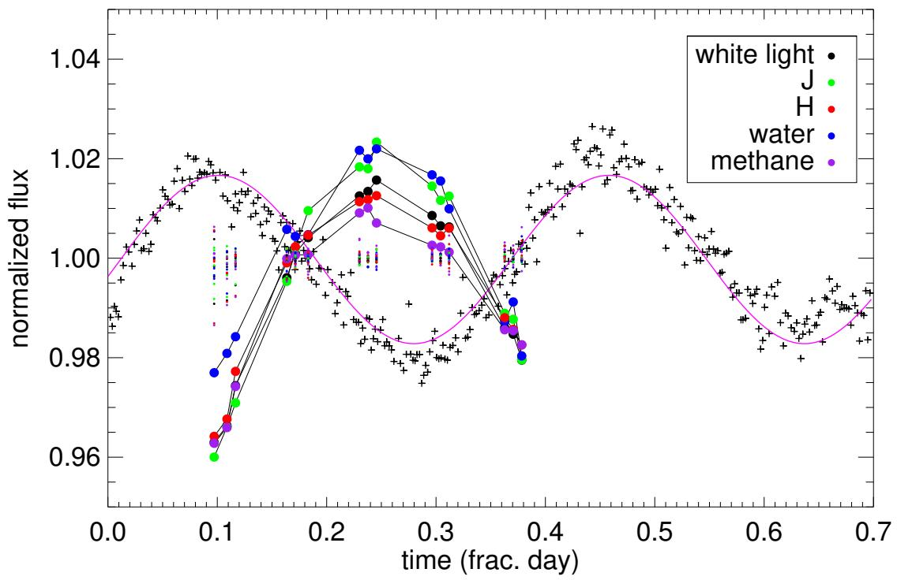  
Figure 1. Spitzer (crosses) and HST lightcurves (filled circles) for PSO J318.5-22, after correction for the ramp effect. The lightcurves have been binned to increase S/N ratio, resulting in a 2.5 minute cadence for Spitzer and a 14 minute cadence for HST. The leastsquares best fit to the Spitzer lightcurve is shown as a solid purple line. HST lightcurves are shown binned over 5 spectral bandwidths: the full usable 1.07 - 1.67 µm spectral bandwidth of the HST grism spectroscopy (white light, black circles), the 2MASS J band (green circles), the 2MASS H band up to the spectral cutoff at 1.67 µm (red circles), a band centered on the $1 . 4 ~ \mu \mathrm { m }$ water absorption feature (blue circles), and a band covering as much of the $1 . 6 \ \mu \mathrm { m }$ methane absorption features as falls in the HST G141 grism spectral bandwidth (purple circles). Small colored points are the 6 background stars in the HST field after being detrended by the calibration curve; PSO J318.5-22 is clearly variable compared to the reference stars. The large $2 0 0 – 2 1 0 ^ { \circ }$ phase offsets between the near-IR and mid-IR lightcurves likely indicates varying longitudinal atmospheric structure at different depths in this atmosphere.

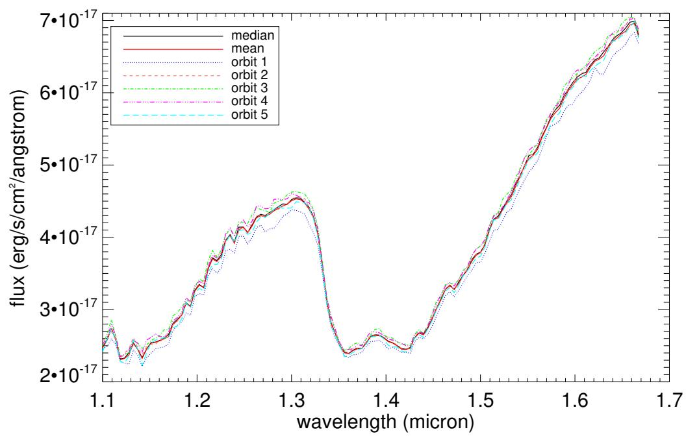

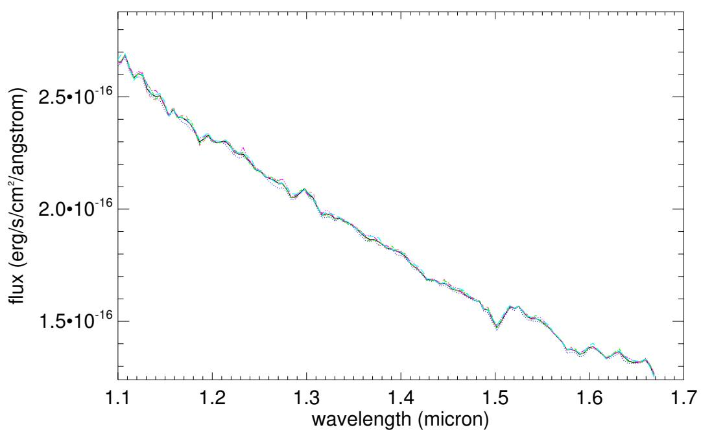  
Figure 2. Top: The mean and median spectra across the full 5 orbit HST observation. Significant spectral variability is apparent. Bottom: Similar spectra for one of the wellbehaved, non-variable reference stars in the HST field. The legend is shared between both panels.

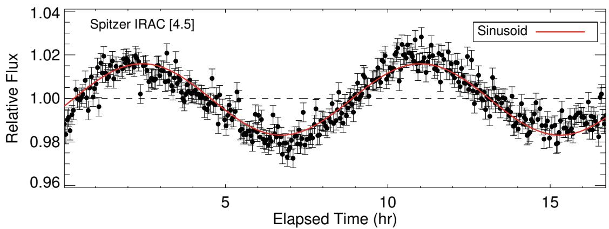

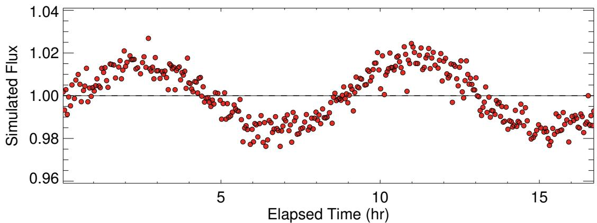

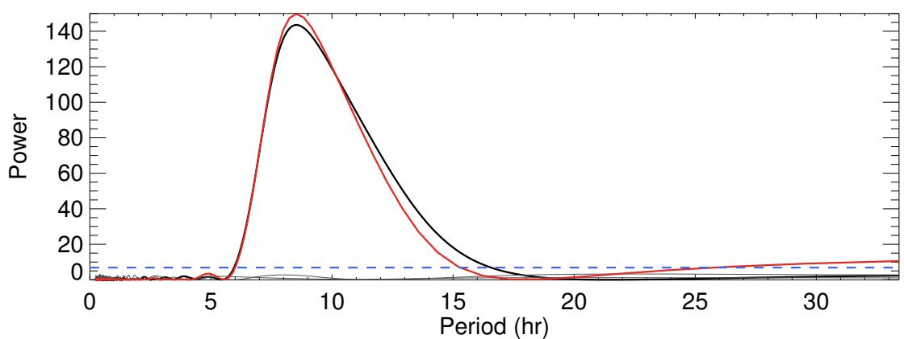  
Figure 3. The top panel shows the normalized, pixel phase corrected lightcurve of PSO J318.5-22 with best-fit sinusoidal function overplotted in red. The middle panel shows the best fit function with Gaussian noise added – this simulated lightcurve closely resembles the observed lightcurve. The bottom panel shows the periodogram of the target and the simulated curve, as well as the periodogram of several reference stars in the field. The blue dashed line shows the $1 \%$ false-alarm probability.

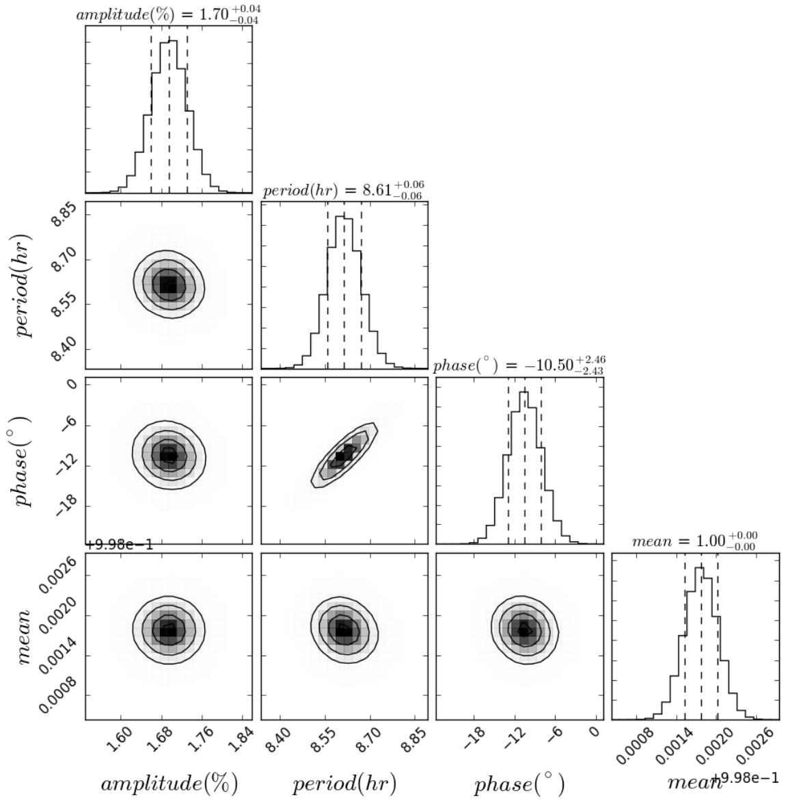  
Figure 4. Posterior probability distributions of parameters from sinusoid MCMC fits to our Spitzer Channel 2 lightcurve of PSO J318.5-22. The mean parameter is the mean value of the lightcurve – since we have divided the raw lightcurve by the median flux over the whole observation, this should tend towards unity. In the marginalized confidence interval plots, the middle dashed line gives the median, the two outer vertical dashed lines represent the 68% confidence interval. The contours show the 1, 1.5 and 2- $\sigma$ levels.

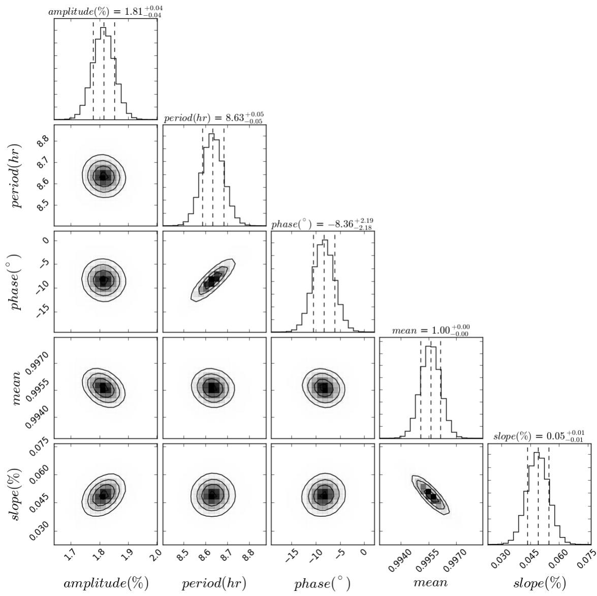  
Figure 5. Posterior probability distributions of parameters from sinusoid+linear MCMC fits to our Spitzer Channel 2 lightcurve of PSO J318.5-22. In the marginalized confidence interval plots, the middle dashed line gives the median, the two outer vertical dashed lines represent the 68% confidence interval. The contours show the 1, 1.5 and 2- $\sigma$ levels.

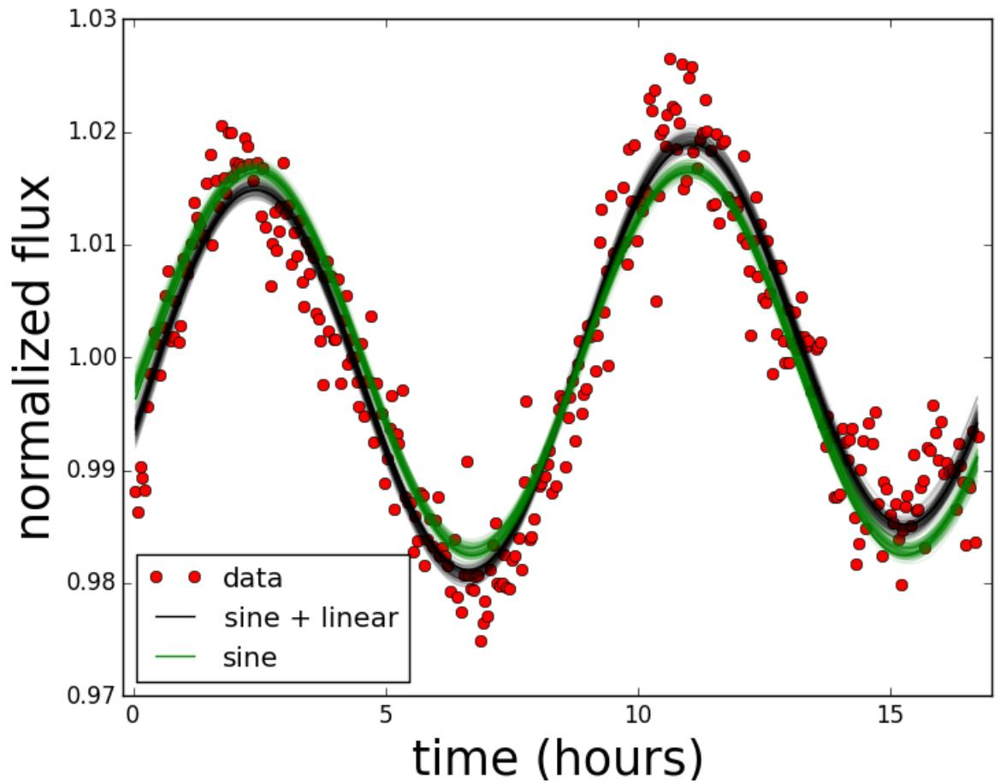  
Figure 6. 100 sample model lightcurves drawn respectively from our sinusoid (green) and sinusoid+linear (black) MCMC fits to the Spitzer Channel 2 lightcurve (plotted as filled red circles).

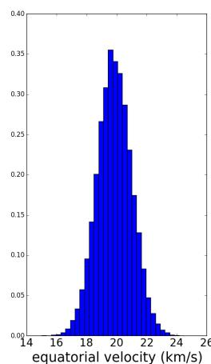

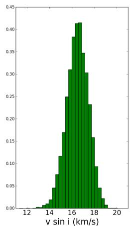

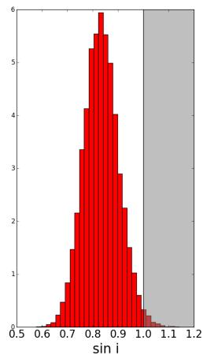

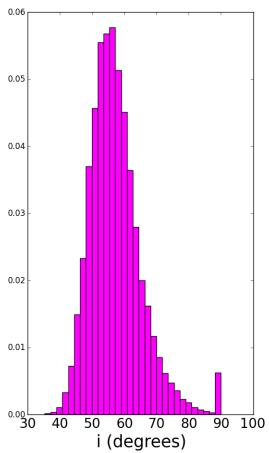  
Figure 7. Left: Gaussian distribution in equatorial velocity derived from our measured period and radius estimates from (Allers et al. 2016). Center left: vsini distribution from fits of the high resolution spectrum of PSO J318.5-22 from (Allers et al. 2016). Center right: sini distribution. The shaded gray rectangle indicates values of sini above 1, which are unphysical and are a result of our adopted uncertainties in radius, period, and vsini for this object. Right: inclination distribution. Unphysical values of sini have been pinned to 1 here (i.e. $9 0 ^ { \circ }$ inclination).

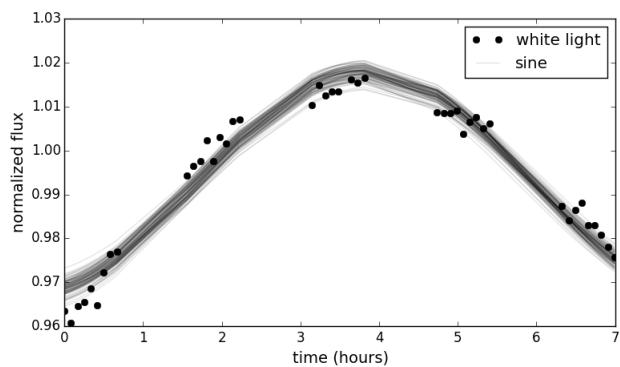

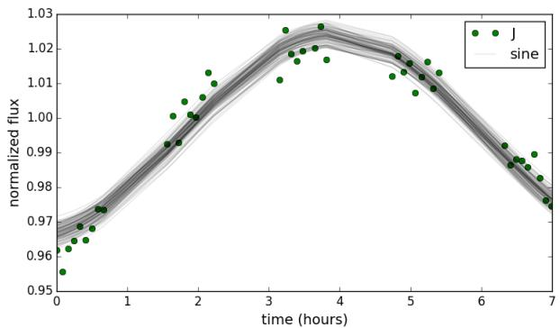

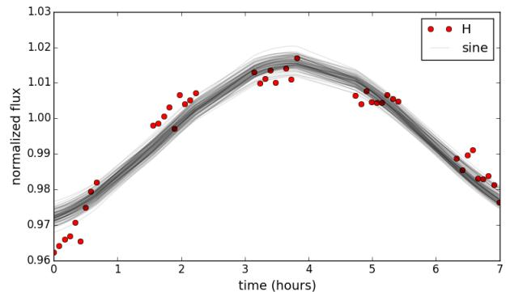

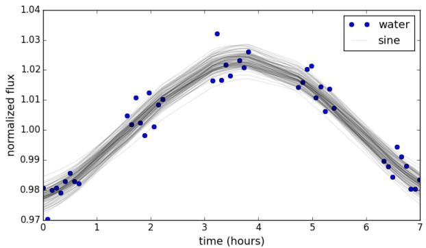

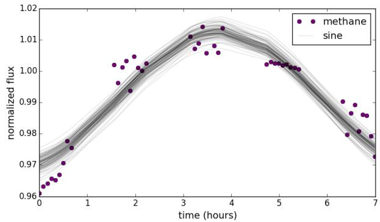  
Figure 8. 100 sample model lightcurves drawn from our sinusoid (black) MCMC fits to each synthesized HST lightcurve (white light, 2MASS J, 2MASS H, water, and methane). All lightcurves except the water lightcurve show a significant deviation from the sinusoidal fits in the first 30 minutes of the observation; given that the water lightcurve appears sinusoidal, this is not a result of the ramp effect, which should affect all wavelengths equally.

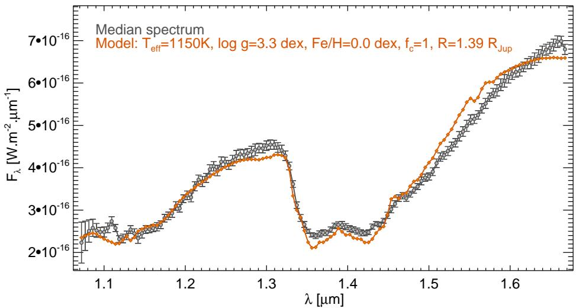

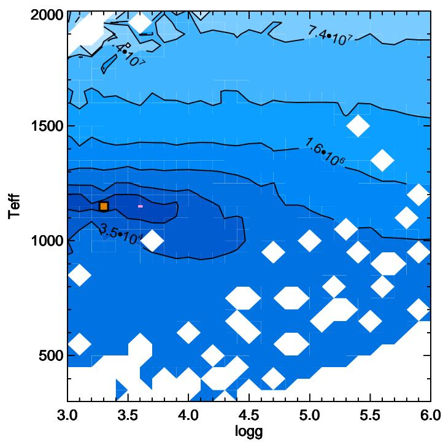  
Figure 9. Top: Comparison of the HST median spectrum of PSO J318.5-22 to the ExoREM models when the radius is allowed to vary in the range 1.29 - 1.35 $R _ { J u p }$ . Bottom: $\chi ^ { 2 }$ map for the solar-metallicity models with a full cloud cover. The orange square corresponds to the $\chi ^ { 2 }$ minimum.

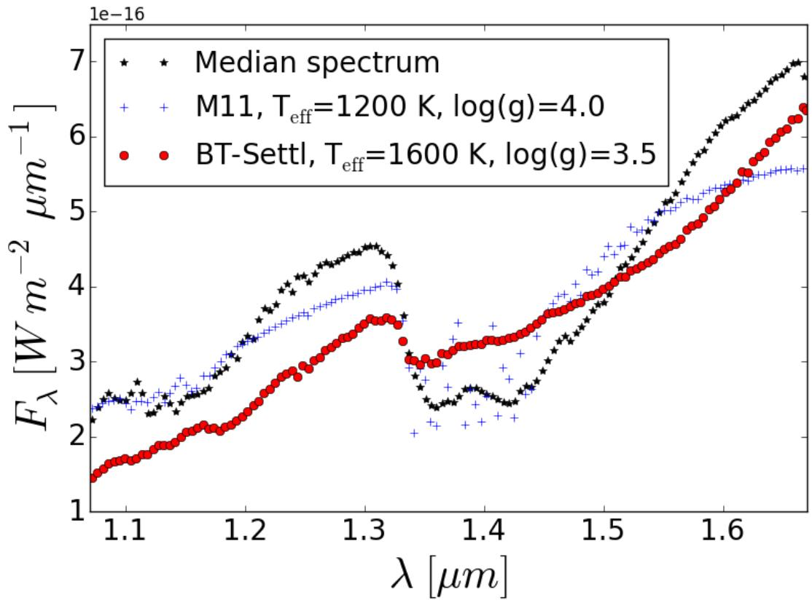  
Figure 10. Best BT-Settl (red circles) and M11 model (blue crosses) fits overplotted with the HST median spectrum of PSO J318.5-22 (black stars). These models do not reproduce the steepness of the observed spectral slope from 1.2 to 1.35 µm or from 1.4 to 1.7 µm. The best fit BT-Settl model had $T _ { \mathrm { e f f } }$ =1600 K and $l o g ( g ) = 3 . 5$ , although a range of models with $T _ { \mathrm { e f f } } = 1 5 0 0 - 1 7 0 0 K$ and $\begin{array} { r } { l o g ( g ) = 3 - 5 } \end{array}$ fit the spectra nearly as well. The ${ T _ { \mathrm { e f f } } { = } } 1 6 0 0 \ \mathrm { K }$ and $l o g ( g ) = 3 . 5$ best fit is driven by the fitting algorithm’s attempt to fit the spectral slope in H band. For the Madhusudhan et al. (2011) models, the best fits were obtained for the model A (thick clouds), 60 µm grains, $T _ { \mathrm { e f f } } = 1 1 0 0 - 1 2 0 0 K$ and $l o g ( g ) = 3 . 7 5 - 4 . 2 5 ~ d e x$ .

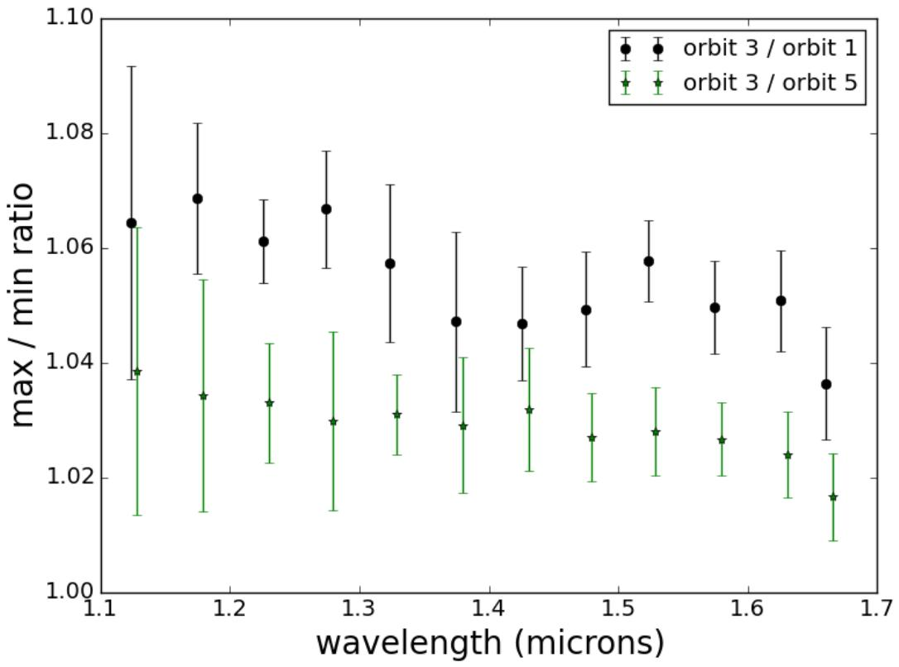  
Figure 11. Ratio of maximum and minimum PSO J318.5-22 HST spectra, binned by 0.05 µm. The minimum value of brightness measured during our time series occurred in orbit 1. However, orbit 1 was the most affected by the ramp effect. Orbit 5 is also near a minimum of the lightcurve and should not be affected as strongly by the ramp effect. Thus, we plot here two max / min spectral ratios: orbit 3 divided by orbit 1 and orbit 3 divided by orbit 5. The spectral ratio for orbit 3 divided by orbit 5 has been offset slightly in wavelength for clarity. As our HST observations did not cover a full period, these are lower limits on the full amplitude.

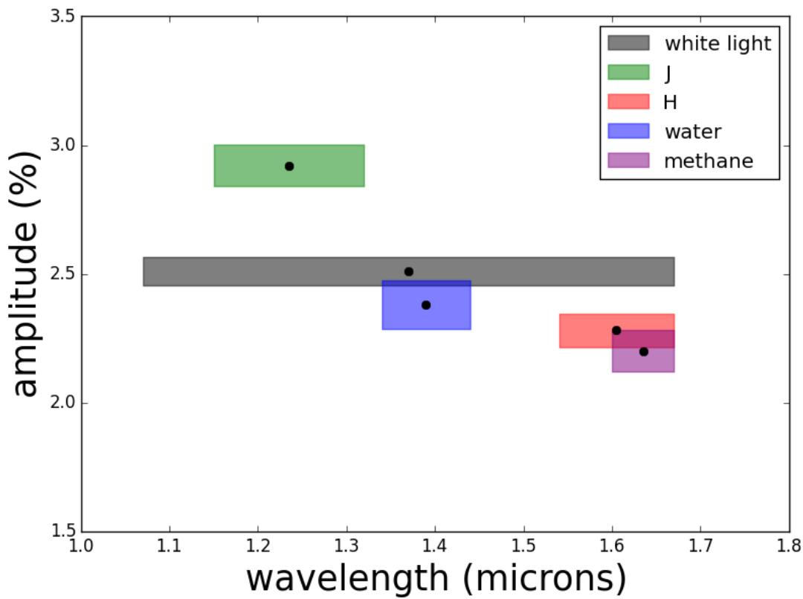

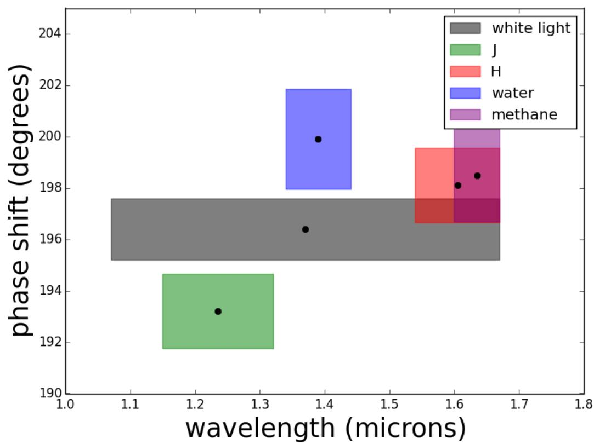  
Figure 12. Top: Wavelength vs. measured variability amplitude for HST synthesized lightcurves. Shaded boxes gives the passband used on the wavelength axis and the 1- $\sigma$ error on the amplitude axis. Amplitude appears to decrease from shorter to longer wavelengths. Bottom: Wavelength vs. measured phase relative to the Spitzer channel 2 lightcurve. Shaded boxes gives the passband used on the wavelength axis and the 1- $\sigma$ error on the phase shift axis. Phase shifts across each of the synthesized bandpasses agree at the 2- $\sigma$ level; J band is phase shifted by ${ \sim } 6 ^ { \circ }$ relative to the other near-IR bands.

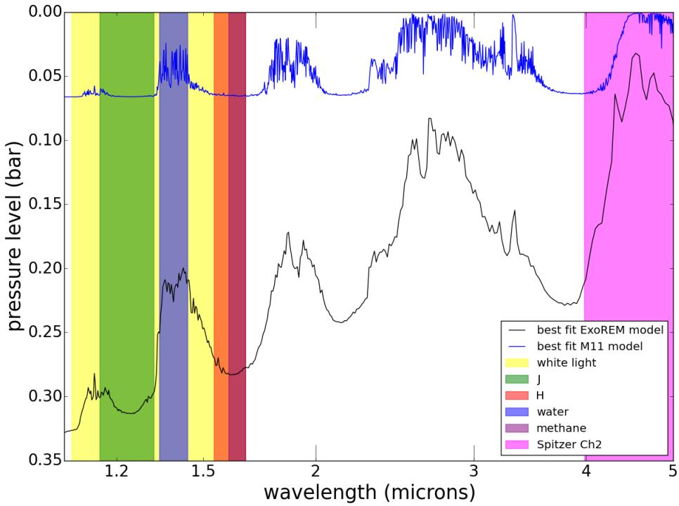  
Figure 13. Pressure spectra for best-fit ExoREM (black, Teff=1150 K, log(g)=3.3 dex, M/H=0.0 dex, and R=1.39 RJup) and M11 models (blue, A60, Teff=1100 K, log(g)=4, solar metallicity). The bandpasses for the HST synthesized lightcurves and the Spitzer channel 2 lightcurve are shown as shaded boxes. For both models, mid-IR flux is generated higher in the atmosphere than near-IR flux.

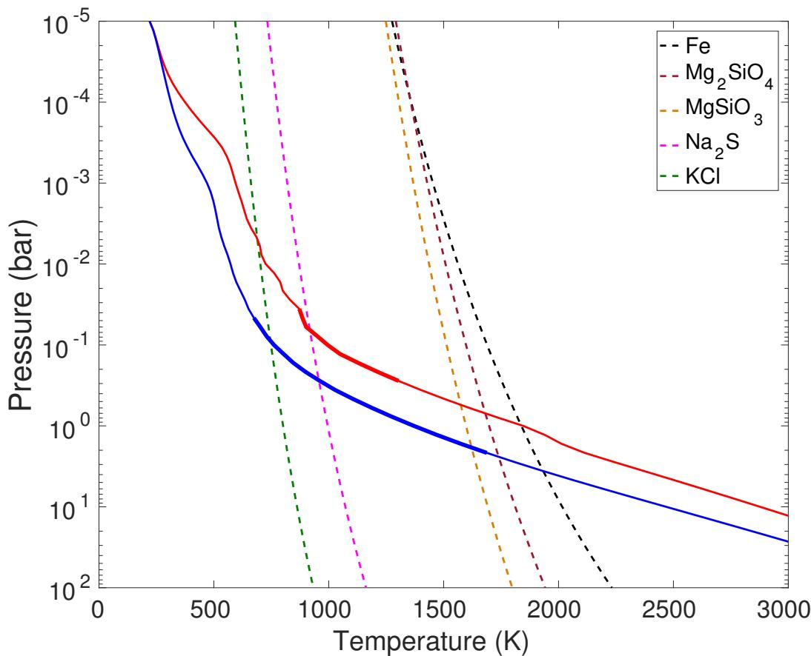  
Figure 14. Pressure / temperature profile for both our best fit ExoREM cloudy model (red curve) and an equivalent clear model (blue curve) with other parameters unchanged. Thick lines correspond to the photosphere (computed from 0.6 to 5 µm) and dashed lines are condensation temperatures for the different clouds present in the model. The presence of clouds increases the temperature by around 200 K in the photosphere region.

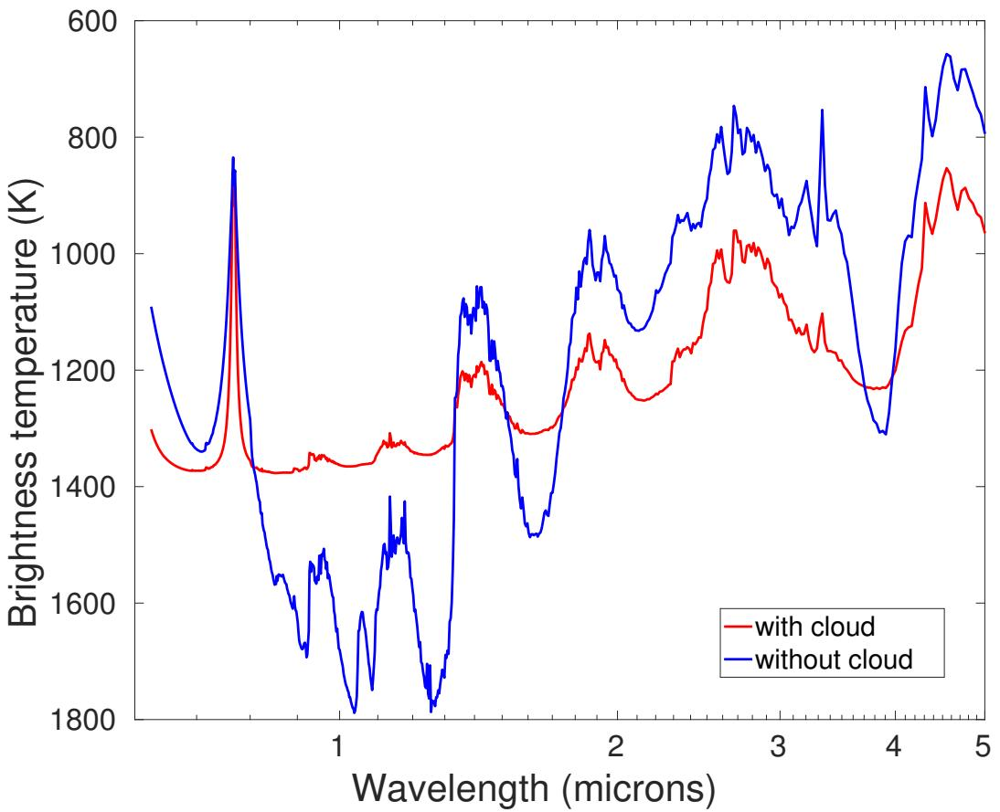  
Figure 15. Wavelength vs. brightness temperature for our best-fit ExoREM cloudy model (red curve) and an equivalent clear model (blue curve) with other parameters unchanged, showing where in the spectrum the brightness temperature increases/decreases with clouds. In the cloudy case, the brightness temperature increases at longer wavelengths (e.g. 3 and $4 . 5 ~ \mu \mathrm { { m } }$ ) by around 200 K relative to the clear case. The opposite is true at shorter wavelengths (∼1-2 µm), where the brightness temperature decreases by 200 K relative to the clear case. While we do not expect any fully clear patches on this object, longitudinal variations in the cloud thickness should produce similar trends and thus a ${ \sim } 1 8 0 ^ { \circ }$ phase shift between near- and mid-IR lightcurves.

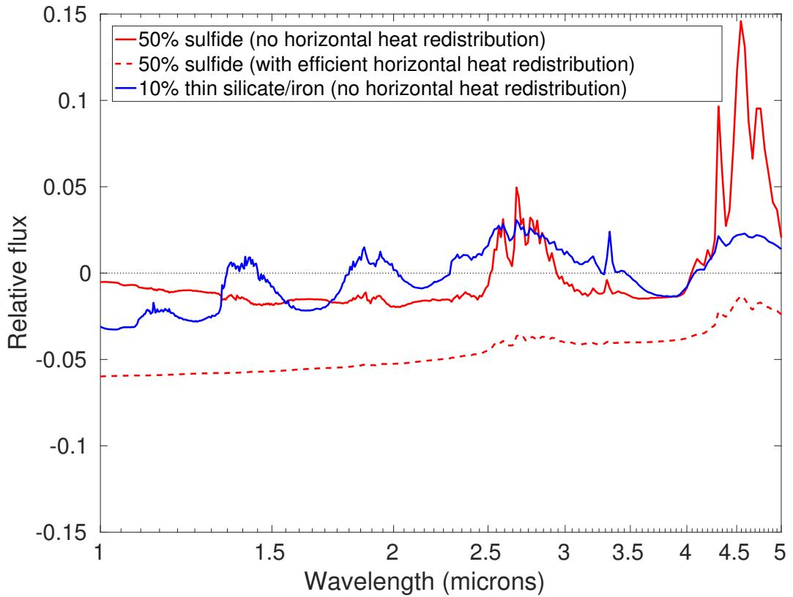  
Figure 16. Predicted light curve amplitude that would be produced assuming: (1) a spot with optically thinner silicate and iron cloud thickness, covering 10% of the surface, and homogeneous thick silicate / iron clouds on the remaining 90% (blue curve) and (2) one hemisphere covered by sulfide clouds and no sulfide clouds on the other hemisphere, with homogeneous silicate/iron clouds for both hemispheres (red curves). Case (2a) was computed assuming no horizontal heat redistribution between the less cloudy spot and the rest of the brown dwarf. Case (2b) was computed with no horizontal heat redistribution (solid line) and with very efficient heat redistribution (dashed line).

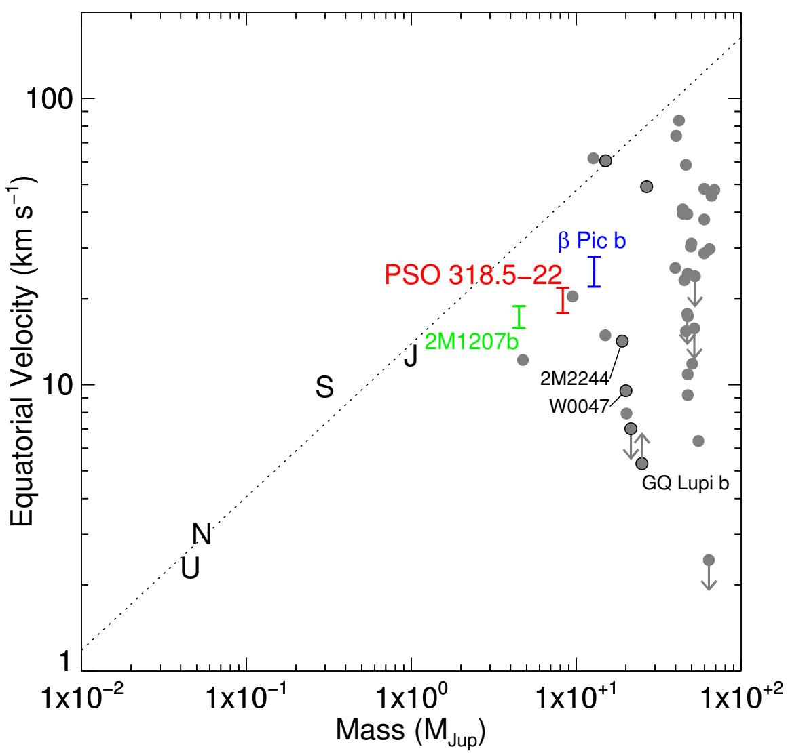  
Figure 17. Mass vs. equatorial velocity for young, planetary mass objects including PSO J318.5-22, as well as the exoplanet $\beta$ Pic b, 2M1207b, and two ∼20 M $J u p$ members of AB Dor, 2M2244 and W0047. Solar system planets and brown dwarfs with measured periods from Vos et al. (2017a) are plotted as gray circles; young brown dwarfs are plotted as gray circles outlined in black. Planetary mass objects seem to encompass a similar range of equatorial velocities as older, field brown dwarfs, with both rapid rotators and notable slow rotators such as the young, 30-40 M $J u p$ brown dwarf companion GQ Lup b (Schwarz et al. 2016).

  
Figure 18. Posterior probability distributions of parameters from sinusoid MCMC fits to the HST ”white light” lightcurve (full bandpass from 1.07 to 1.67 µm) for PSO J318.5-22. Since the HST observation does not cover a full rotation period, we have fixed the period to 8.6 hours, as found from the Spitzer lightcurve. In the marginalized confidence interval plots, the middle dashed line gives the median, the two outer vertical dashed lines represent the 68% confidence interval. The contours show the 1, 1.5 and 2- $\sigma$ levels.

# APPENDIX

# A. HST LIGHTCURVE MCMC POSTERIORS

MCMC posteriors for sinusoidal fits to HST lightcurves are presented in Fig. 18 through Fig. 22.

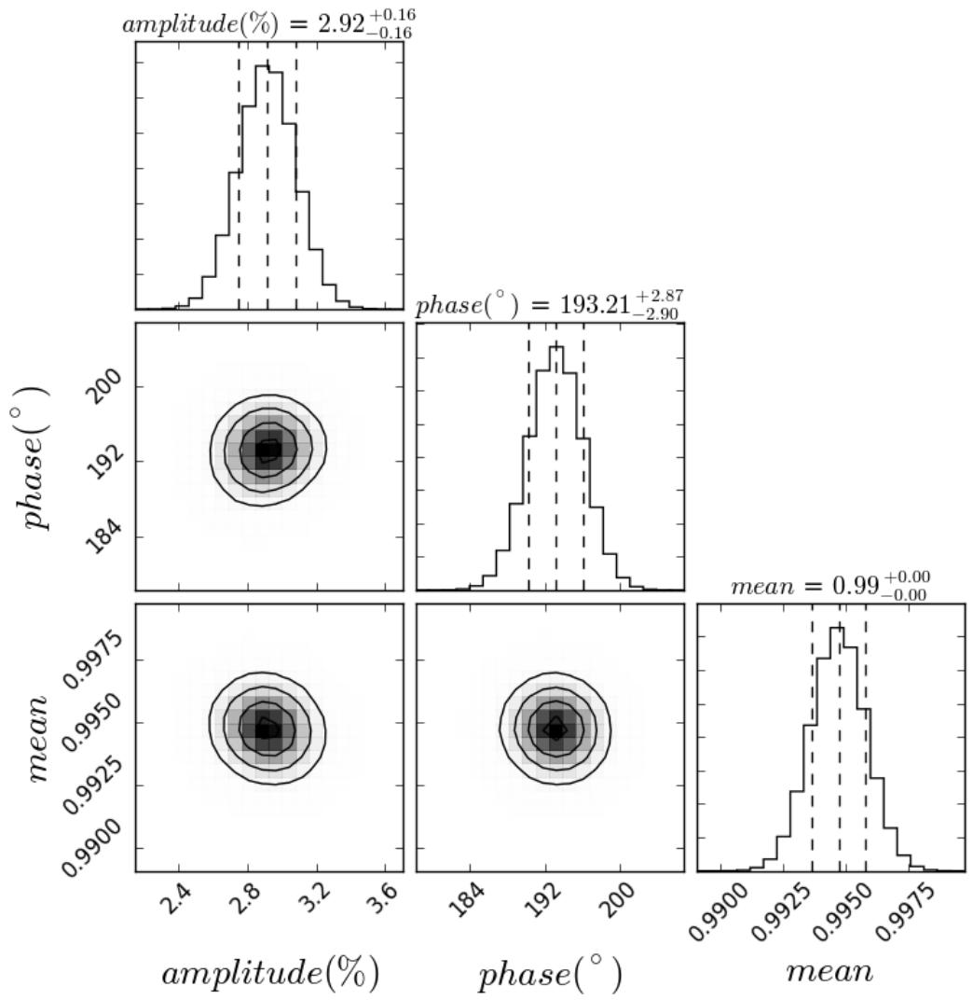  
Figure 19. Posterior probability distributions of parameters from sinusoid MCMC fits to the HST synthesized 2MASS J lightcurve for PSO J318.5-22. Since the HST observation does not cover a full rotation period, we have fixed the period to 8.6 hours, as found from the Spitzer lightcurve. In the marginalized confidence interval plots, the middle dashed line gives the median, the two outer vertical dashed lines represent the 68% confidence interval. The contours show the 1, 1.5 and 2- $\sigma$ levels.

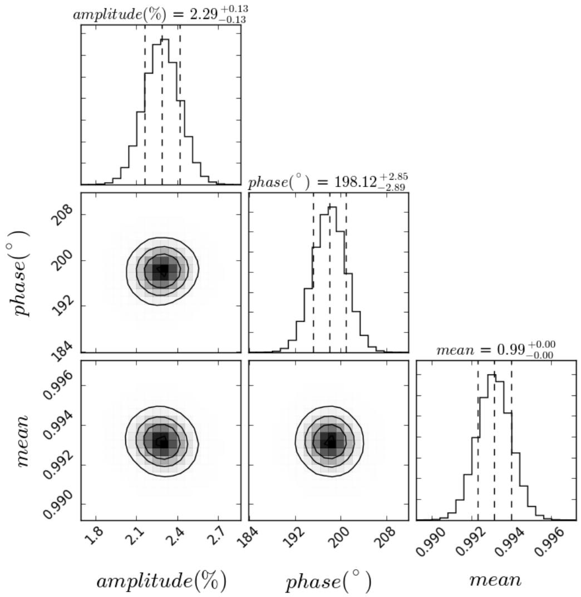  
Figure 20. Same as Fig. 19, for the HST synthesized 2MASS H lightcurve.

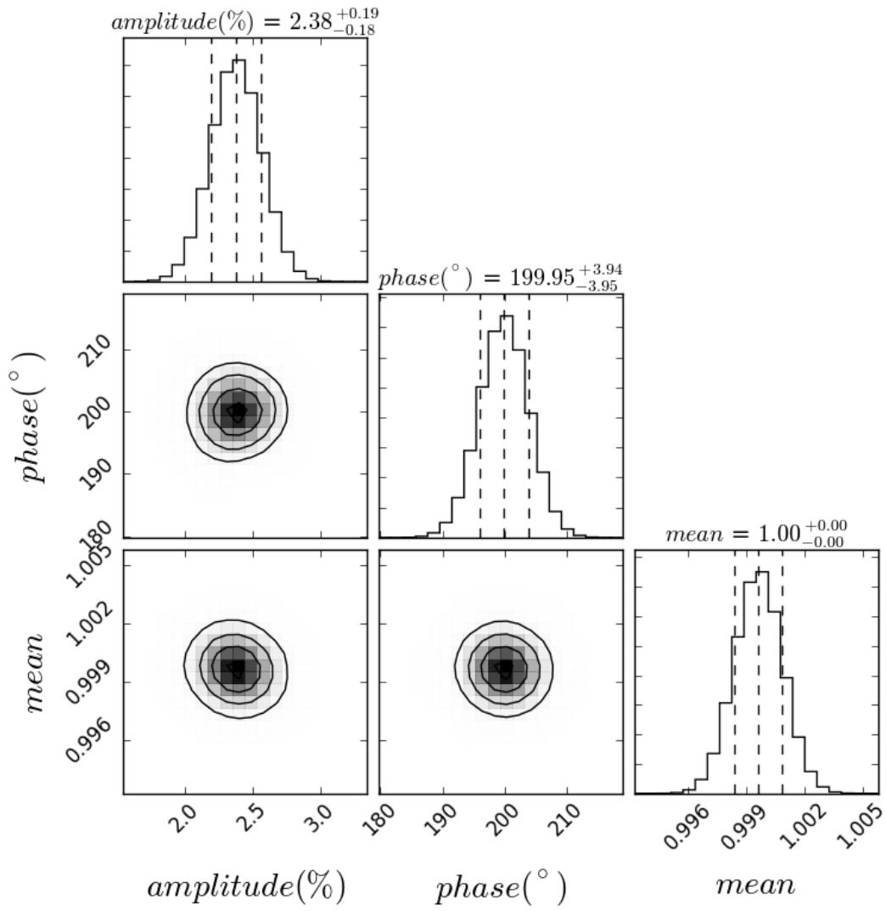  
Figure 21. Same as Fig. 19, for the HST synthesized water band lightcurve (1.34 to 1.44 $\mu$ m).

Facilities: HST(WFC3), Spitzer(IRAC)

Software: python, astropy, IDL, emcee

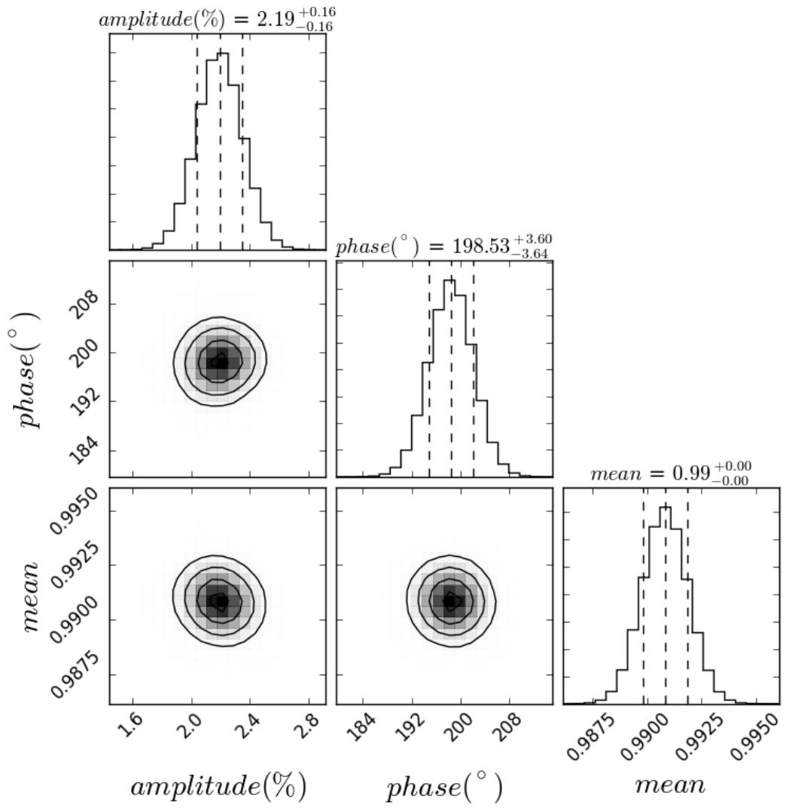  
Figure 22. Same as Fig. 19, for the HST synthesized methane band lightcurve (1.60 to 1.67 µm).